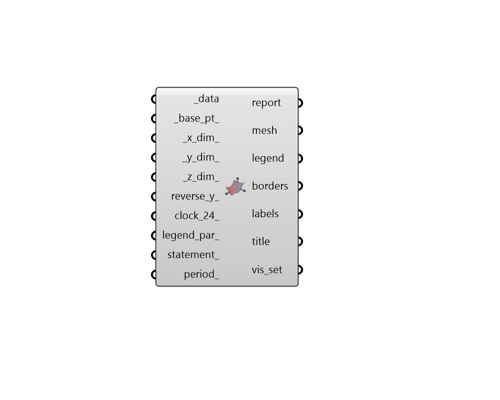

## Hourly Plot

 - [[source code]](https://github.com/ladybug-tools/ladybug-grasshopper/blob/master/ladybug_grasshopper/src//LB%20Hourly%20Plot.py)

Create a colored plot of any hourly data collection. 

#### Inputs
* ##### data [Required]
A HourlyContinuousCollection or HourlyDiscontinuousCollection which will be used to generate the hourly plot. 
* ##### base_pt 
An optional Point3D to be used as a starting point to generate the geometry of the plot (Default: (0, 0, 0)). 
* ##### x_dim 
A number to set the X dimension of the mesh cells (Default: 1 meters). 
* ##### y_dim 
A number to set the Y dimension of the mesh cells (Default: 4 meters). 
* ##### z_dim 
A number to set the Z dimension of the entire chart. This will be used to make the colored_mesh3d of the chart vary in the Z dimension according to the data. The value input here should usually be several times larger than the x_dim or y_dim in order to be noticable (e.g. 100). If 0, the colored_mesh3d will simply be flat. (Default: 0). 
* ##### reverse_y 
Boolean to note whether the Y-axis of the chart is reversed If True, time over the course of the day will flow from the top of the chart to the bottom instead of the bottom to the top. 
* ##### clock_24 
Boolean to note whether the hour labels on the Y-Axis of the chart should be in 24-hour clock format (eg. 18:00) or they should be in 12-hour clock format (eg. 6PM). 
* ##### legend_par 
An optional LegendParameter object to change the display of the HourlyPlot. This can also be a list of legend parameters to be applied to the different connected _data. 
* ##### statement 
A conditional statement as a string (e.g. a > 25). 
The variable of the first data collection should always be named 'a' (without quotations), the variable of the second list should be named 'b', and so on. 
For example, if three data collections are connected to _data and the following statement is applied: '18 < a < 26 and b < 80 and c > 2' The resulting collections will only include values where the first data collection is between 18 and 26, the second collection is less than 80 and the third collection is greater than 2. 
* ##### period 
A Ladybug analysis period to be applied to all of the input _data. 

#### Outputs
* ##### report
... 
* ##### mesh
A colored mesh derived from the input _data. Multiple meshes will be output for several data collections are input. 
* ##### legend
Geometry representing the legend for each mesh. 
* ##### borders
A list of lines and polylines representing different time intervals of the plot. 
* ##### labels
A list of text objects that label the borders with the time intervals that they demarcate. 
* ##### title
A text object for the global_title. 
* ##### vis_set
An object containing VisualizationSet arguments for drawing a detailed version of the Hourly Plot in the Rhino scene. This can be connected to the "LB Preview Visualization Set" component to display this version of the Hourly Plot in Rhino. 