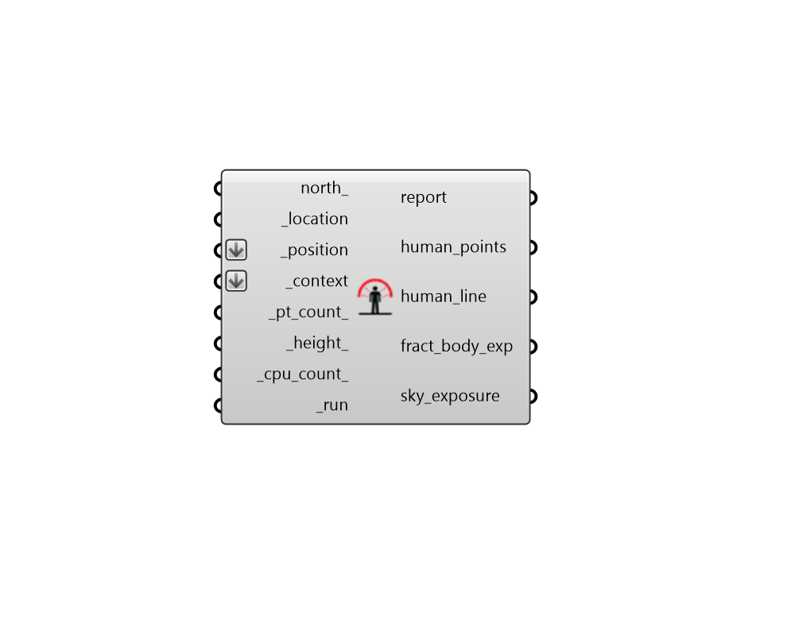

## Human to Sky Relation
 - [[source code]](https://github.com/ladybug-tools/ladybug-grasshopper/blob/master/ladybug_grasshopper/src//LB%20Human%20to%20Sky%20Relation.py)

Calculate parameters for the relationship between human geometry and the sky given
 the position of a human subject and context geometry surrounding this position.
 

The outputs of this component can be plugged into either the "LB Outdoor Solar MRT"
 or the "LB Indoor Solar MRT" in order to account for context shading around a
 human subject in these MRT calculations.
 

#### Inputs
* ##### north 
A number between -360 and 360 for the counterclockwise difference between the North and the positive Y-axis in degrees. 90 is West and 270 is East. This can also be Vector for the direction to North. (Default: 0) 
* ##### location [Required]
A ladybug Location that has been output from the "LB Import EPW" component, the "LB Import Location" component, or the "LB Construct Location" component. This will be used to compute hourly sun positions for the fract_body_exp. 
* ##### position [Required]
A point for the position of the human subject in the Rhino scene. This is used to understand where a person is in relationship to the _context. The point input here should be at the feet of the human a series of points will be generated above. This can also be a list of points, which will result in several outputs. 
* ##### context [Required]
Rhino Breps and/or Rhino Meshes representing context geometry that can block the human subject's direct sun and view to the sky. 
* ##### pt_count 
A positive integer for the number of points used to represent the human subject geometry. Points are evenly distributed over the _height_ and are used to compute fracitonal values for the fract_body_exp in the case that only some of the points can see the sun. When context shade around the subject is large or coarse, using a single point is likely to return similar results as using several points. However, this number should be increased when context is detailed and has the potential to shade only part of the human subject at a given time. (Default: 1). 
* ##### height 
A number for the the height of the human subject in the current Rhino Model units. (Default: 1.8 m in the equivalent Rhino Model units; roughly the average height of a standing adult). 
* ##### parallel 
Set to "True" to run the study using multiple CPUs. This can dramatically decrease calculation time but can interfere with other computational processes that might be running on your machine. (Default: False). 
* ##### run [Required]
Set to "True" to run the component and compute the human/sky relationship. If set to "False" but all other required inputs are specified, this component will output points showing the human subject. 

#### Outputs
* ##### report
... 
* ##### human_points
The points used to represent the human subject in the calculation of the fraction of the body exposed to sun. Note that these are generated even when _run is set to "False". 
* ##### human_line
Line representing the height of the human subject. Note that this is generated even when _run is set to "False". 
* ##### fract_body_exp
A data collection for the fraction of the body exposed to direct sunlight at each hour of the year. This can be plugged into the "Solar MRT" components in order to account for context shading in the computation of MRT. 
* ##### sky_exposure
A single number between 0 and 1 for the fraction of the sky vault in human subject’s view. This can be plugged into the "Solar MRT" components in order to account for context shading in the computation of MRT. 