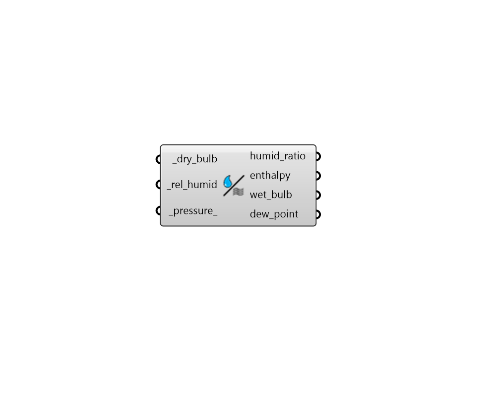

## Humidity Metrics

 - [[source code]](https://github.com/ladybug-tools/ladybug-grasshopper/blob/master/ladybug_grasshopper/src//LB%20Humidity%20Metrics.py)

Calculate humidity metrics from relative humidity, dry bulb temperature and (if present) atmospheric pressure. 

#### Inputs
* ##### dry_bulb [Required]
A value or data collection representing  dry bulb temperature [C] 
* ##### rel_humid [Required]
A value or data collection representing relative humidity [%] 
* ##### pressure 
A value or data collection representing atmospheric pressure [Pa] Default is to use air pressure at sea level (101,325 Pa). 

#### Outputs
* ##### humid_ratio
A data collection or value for humidity ratio (aka. absolute humidity). Units are fractional (kg water / kg air). 
* ##### enthalpy
A data collection or value for enthalpy (kJ / Kg). 
* ##### wet_bulb
A data collection or value for wet bulb temperature (C). 
* ##### dew_point
A data collection or value for dew point temperature (C). 