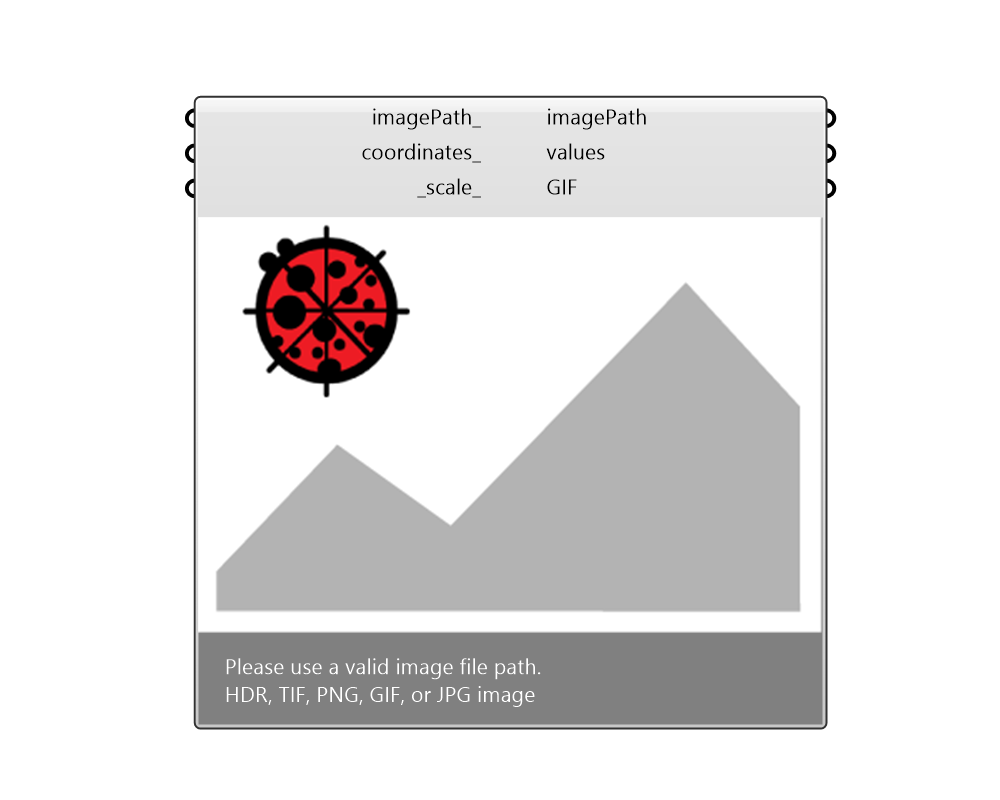

# ImageViewer

 - [\[source code\]](https://github.com/ladybug-tools/ladybug-grasshopper/blob/master/ladybug\_grasshopper/src/LB%20ImageViewer.py)

Preview image files Please find the source code from: [https://github.com/ladybug-tools/ladybug-grasshopper-dotnet](https://github.com/ladybug-tools/ladybug-grasshopper-dotnet)

## Inputs

*   **imagePath**

    one or a list of image file path.&#x20;
*   **coordinates**

    A list of points for extracting colors from the source image.&#x20;
*   **scale**

    Set this image view port scale.&#x20;

## Outputs

*   **imagePath**

    A new image marked with coordinates.&#x20;
*   **values**

    Color information or Radiance value that extracted from the input image. Radiance value only available on HDR image, and the unit is based on the Radiance study type.  -Illuminance: lux  -Luminance: cd/m2&#x20;
*   **GIF**

    Generates an animated gif image when there is a list of images.&#x20;
