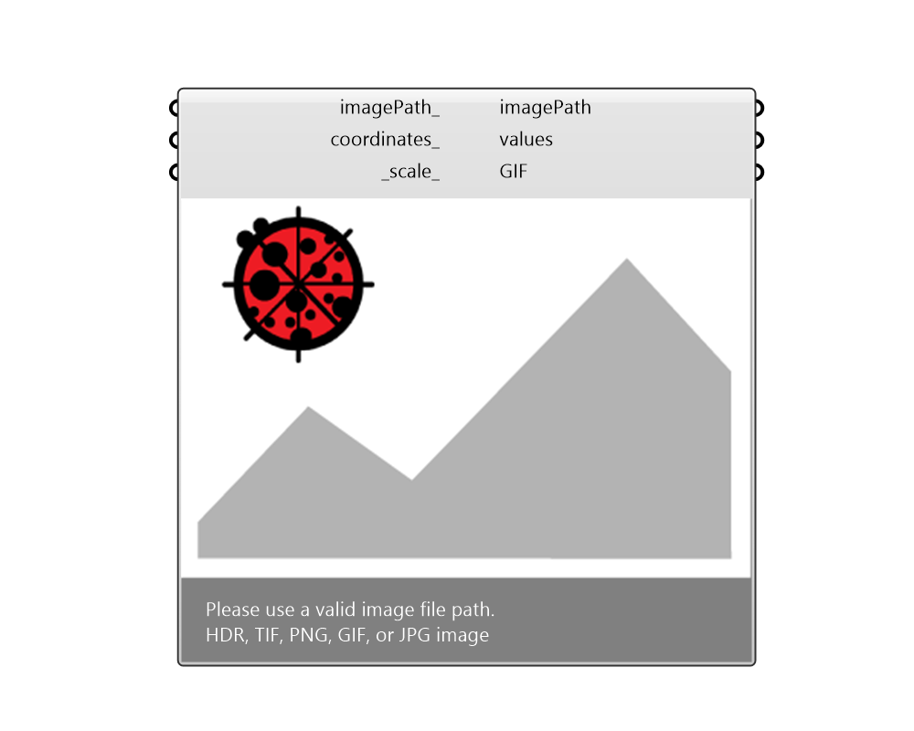

## Image Viewer

 - [[source code]](https://github.com/ladybug-tools/ladybug-grasshopper/blob/master/ladybug_grasshopper/src//LB%20Image%20Viewer.py)

Preview image files  Please find the source code from: https://github.com/ladybug-tools/ladybug-grasshopper-dotnet 

#### Inputs
* ##### imagePath 
one or a list of image file path. 
* ##### coordinates 
A list of points for extracting colors from the source image. 
* ##### scale 
Set this image view port scale. 

#### Outputs
* ##### imagePath
A new image marked with coordinates. 
* ##### values
Color information or Radiance value that extracted from the input image. Radiance value only available on HDR image, and the unit is based on the Radiance study type.  -Illuminance: lux  -Luminance: cd/m2 
* ##### GIF
Generates an animated gif image when there is a list of images. 