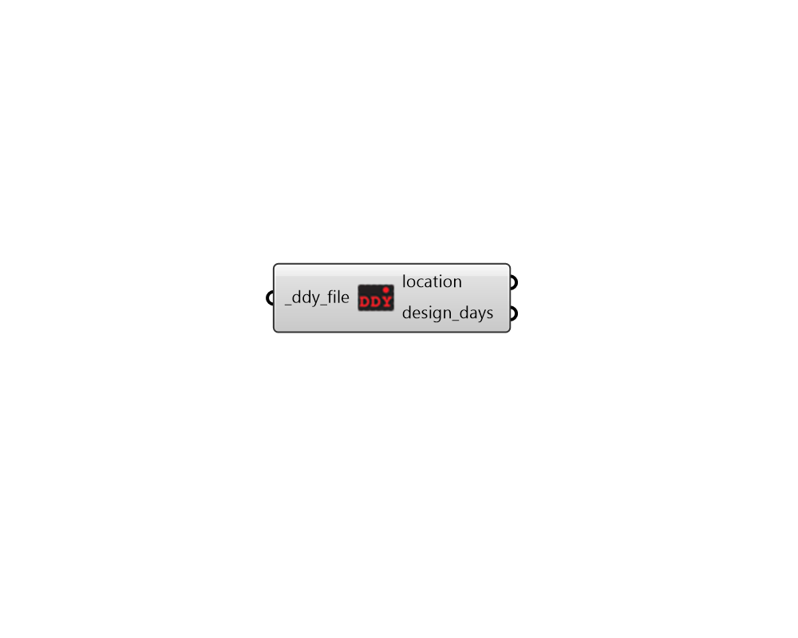

## Import DDY
 - [[source code]](https://github.com/ladybug-tools/ladybug-grasshopper/blob/master/ladybug_grasshopper/src//LB%20Import%20DDY.py)

Import data from a standard .ddy file.
 

#### Inputs
* ##### ddy_file [Required]
A .ddy file path on your system as a string. 

#### Outputs
* ##### location
A Ladybug Location object describing the location data in the DDY file. 
* ##### design_days
A list of DesignDay objects representing the design days contained within the ddy file. 