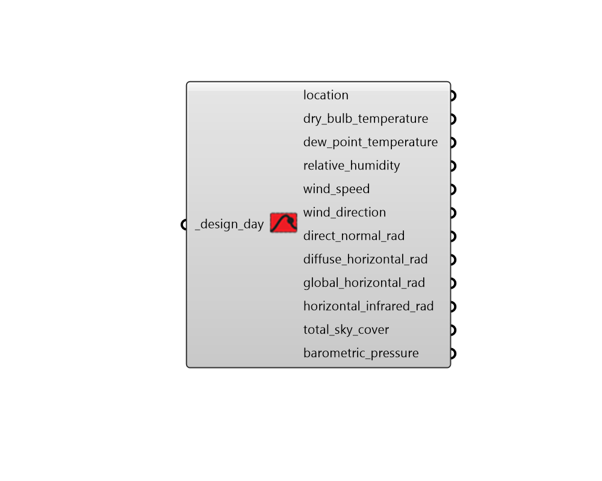

##  Import Design Day - [[source code]](https://github.com/ladybug-tools/ladybug-grasshopper/blob/master/ladybug_grasshopper/src//LB%20Import%20Design%20Day.py)

Import hourly climate data from a Ladybug DesignDay object.
 

#### Inputs
* ##### design_day [Required]
A DesignDay object to import. 

#### Outputs
* ##### location
A Ladybug Location object describing the location of the design day.
* ##### dry_bulb_temperature
The houlry dry bulb temperature over the design day, in C.
* ##### dew_point_temperature
The hourly dew point temperature over the design day, in C.
* ##### relative_humidity
The hourly Relative Humidity over the design day in percent.
* ##### wind_speed
The hourly wind speed over the design day in m/sec.
* ##### wind_direction
The hourly wind direction over the design day in degrees. The convention is that North=0.0, East=90.0, South=180.0, West=270.0.
* ##### direct_normal_rad
The hourly Direct Normal Radiation over the design day in Wh/m2.
* ##### diffuse_horizontal_rad
The hourly Diffuse Horizontal Radiation over the design day in Wh/m2.
* ##### global_horizontal_rad
The hourly Global Horizontal Radiation over the design day in Wh/m2.
* ##### horizontal_infrared_rad
The Horizontal Infrared Radiation Intensity over the design day in Wh/m2.
* ##### total_sky_cover
The fraction for total sky cover over the design day in tenths of coverage.
* ##### barometric_pressure
The hourly weather station pressure over the design day in Pa.