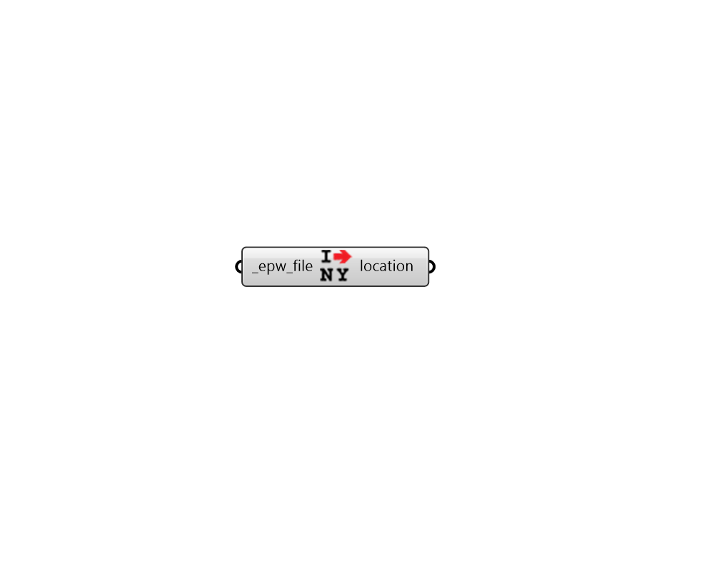

##  Import Location

Import location.
 -

#### Inputs
* ##### epwFile [Required]
An epw file path on your system as a string.

#### Outputs
* ##### location
Location data (use this output to construct the sun path).

[Check Hydra Example Files for Import Location](https://hydrashare.github.io/hydra/index.html?keywords=LadybugPlus_Import Location)