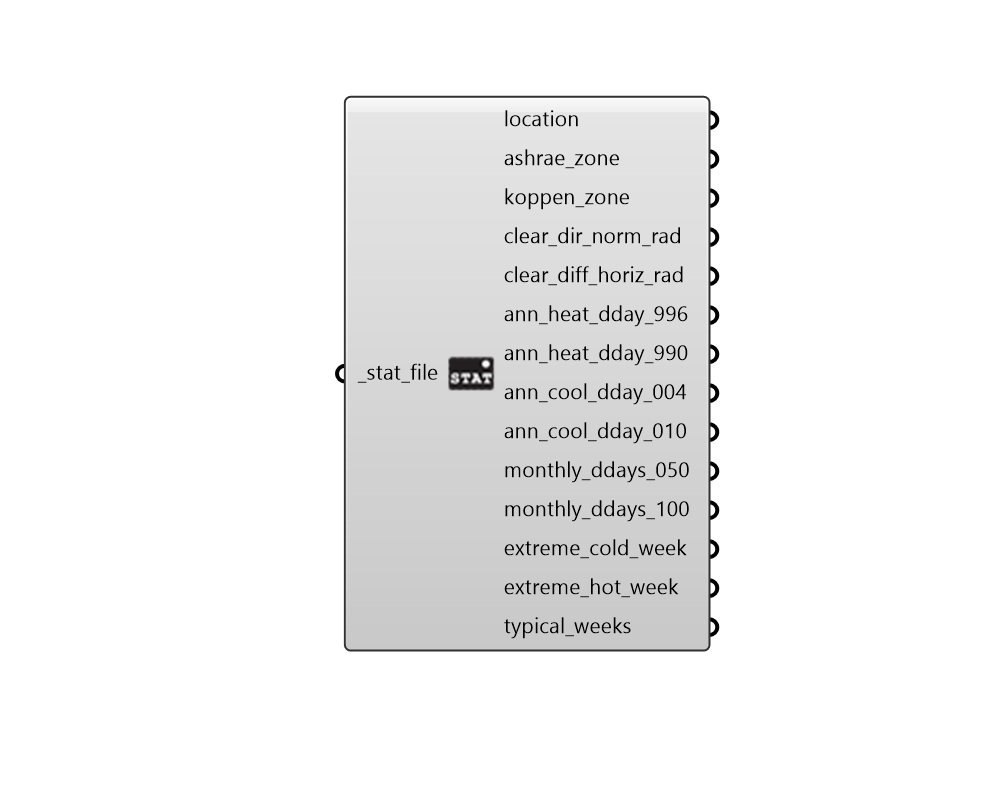

##  Import STAT - [[source code]](https://github.com/ladybug-tools/ladybug-grasshopper/blob/master/ladybug_grasshopper/src//LB%20Import%20STAT.py)

Import data from a standard .stat file.
 

#### Inputs
* ##### stat_file [Required]
A .stat file path on your system as a string. 

#### Outputs
* ##### location
A Ladybug Location object describing the location data in the STAT file.
* ##### ashrae_zone
The ASHRAE climate zone of the STAT file. Numbers in the zone
 denote average temperature (0 = Hottest; 8 = Coldest). Letters in
 the zone denote wetness (A = Humid; B = Dry; C = Marine)
* ##### koppen_zone
The Koppen climate zone of the STAT file. The Koppen climate
 system uses vegetation as in indicator fo climate and combines
 average monthly temperatures, precipitation, and the seasonality
 of precipitation.
* ##### clear_dir_norm_rad
The hourly "Clear Sky" Direct Normal Radiation in Wh/m2.
 Such clear sky radiation is typically used for sizing cooling
 systems. If monthly optical depths are found within the STAT
 file, these values will come from the Revised ASHARAE Clear Sky
 (Tau model). If no optical depths are found, they will come from
 the original ASHARE lear sky model.
* ##### clear_diff_horiz_rad
The hourly "Clear Sky" Diffuse Horizontal Radiation
 in Wh/m2. Such clear sky radiation is typically used for sizing
 cooling systems. If monthly optical depths are found within the
 STAT file, these values will come from the Revised ASHARAE Clear Sky
 (Tau model). If no optical depths are found, they will come from
 the original ASHARE lear sky model.
* ##### ann_heat_dday_996
A DesignDay object representing the annual 99.6%
 heating design day.
* ##### ann_heat_dday_990
A DesignDay object representing the annual 99.0%
 heating design day.
* ##### ann_cool_dday_004
A DesignDay object representing the annual 0.4%
 cooling design day.
* ##### ann_cool_dday_010
A DesignDay object representing the annual 1.0%
 cooling design day.
* ##### monthly_ddays_050
A list of 12 DesignDay objects representing monthly
 5.0% cooling design days.
* ##### monthly_ddays_100
A list of 12 DesignDay objects representing monthly
 10.0% cooling design days.
* ##### extreme_cold_week
A Ladybug AnalysisPeriod object representing the
 coldest week within the corresponding EPW.
* ##### extreme_hot_week
A Ladybug AnalysisPeriod object representing the
 hottest week within the corresponding EPW.
* ##### typical_weeks
A list of Ladybug AnalysisPeriod objects representing
 typical weeks within the corresponding EPW.
 The type of week can vary depending on the climate.
 _
 For mid and high lattitude climates with 4 seasons (eg. New York),
 these weeks are for each of the 4 seasons ordered as follows:
 Winter, Spring, Summer, Autumn
 _
 For low lattitude climates with wet/dry seasons (eg. Mumbai),
 these weeks might also include:
 Wet Season, Dry Season
 _
 For equitorial climates with no seasons (eg. Singapore),
 This output is usually a single week representing typical
 conditions of the entire year.