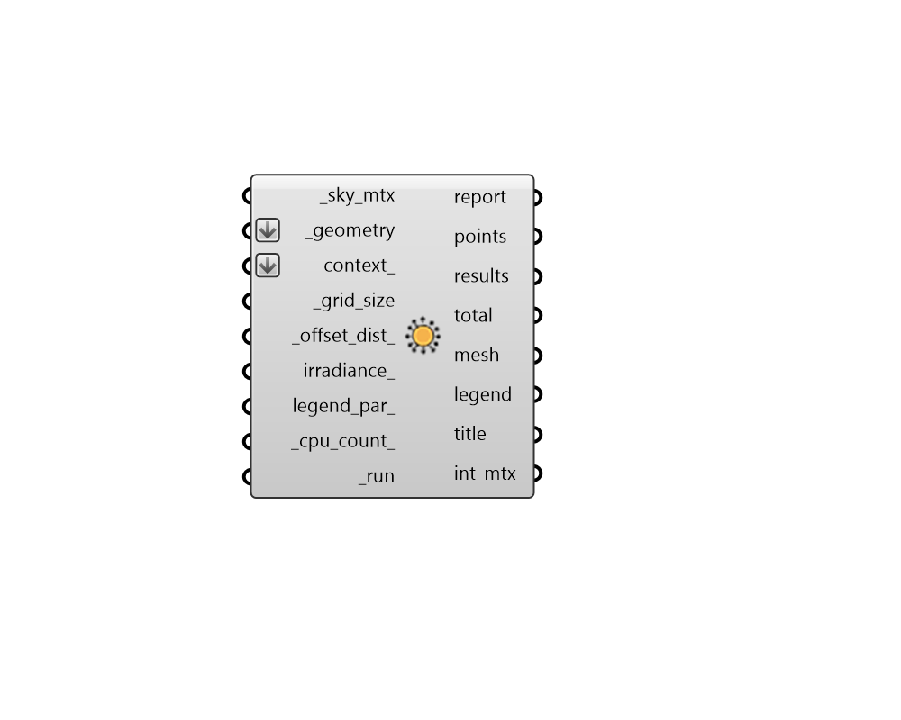

##  Incident Radiation - [[source code]](https://github.com/ladybug-tools/ladybug-grasshopper/blob/master/ladybug_grasshopper/src//LB%20Incident%20Radiation.py)

Calculate the incident radiation on geometry using a sky matrix from the "Cumulative
 Sky Matrix" component.
 

Such studies of incident radiation can be used to apprxomiate the energy that can
 be collected from photovoltaic or solar thermal systems. They are also useful
 for evaluating the impact of a building's windows on both energy use and the
 size/cost of cooling systems. For studies of cooling system size/cost, a sky
 matrix derived from the STAT file's clear sky radiation should be used. For
 studies of energy use impact, such as the evaluation of passive solar heating
 or the potential for excessive cooling energy use, a matrix from EPW radiation
 should be used.
 

Note that NO REFLECTIONS OF SOLAR ENERGY ARE INCLUDED IN THE ANALYSIS
 PERFORMED BY THIS COMPONENT and it is important to bear in mind that vertical
 surfaces typically receive 20% - 30% of their solar energy from reflection off
 of the ground. Also note that this component uses the CAD environment's ray
 intersection methods, which can be fast for geometries with low complexity
 but does not scale well for complex geometries or many test points. For such
 complex cases and situations where relfection of solar energy are important,
 honeybee-radiance should be used.
 

#### Inputs
* ##### sky_mtx [Required]
A Sky Matrix from the "LB Cumulative Sky Matrix" component, which
 describes the radiation coming from the various patches of the sky.
 The "LB Sky Dome" component can be used to visualize any sky matrix
 to understand its relationship to the test geometry. 
* ##### geometry [Required]
Rhino Breps and/or Rhino Meshes for which incident radiation analysis
 will be conducted. If Breps are input, they will be subdivided using
 the _grid_size to yeild individual points at which analysis will
 occur. If a Mesh is input, radiation analysis analysis will be
 performed for each face of this mesh instead of subdividing it. 
* ##### context 
Rhino Breps and/or Rhino Meshes representing context geometry
 that can block solar radiation to the test _geometry. 
* ##### grid_size [Required]
A positive number in Rhino model units for the size of grid
 cells at which the input _geometry will be subdivided for incident
 radiation analysis. The smaller the grid size, the higher the
 resolution of the analysis and the longer the calculation will take.
 So it is recommended that one start with a large value here and
 decrease the value as needed. However, the grid size should usually
 be smaller than the dimensions of the smallest piece of the _geometry
 and context_ in order to yield meaningful results. 
* ##### offset_dist 
A number for the distance to move points from the surfaces
 of the input _geometry.  Typically, this should be a small positive
 number to ensure points are not blocked by the mesh. (Default: 10 cm
 in the equivalent Rhino Model units). 
* ##### legend_par 
Optional legend parameters from the "LB Legend Parameters"
 that will be used to customize the display of the results. 
* ##### parallel 
Set to "True" to run the study using multiple CPUs. This can
 dramatically decrease calculation time but can interfere with
 other computational processes that might be running on your
 machine. (Default: False). 
* ##### run [Required]
Set to "True" to run the component and perform incident radiation
 analysis. 

#### Outputs
* ##### report
...
* ##### points
The grid of points on the test _geometry that are be used to perform
 the incident radiation analysis.
* ##### results
A list of numbers that aligns with the points. Each number indicates
 the cumulative incident radiation received by each of the points
 from the sky matrix in kWh/m2.
* ##### total
A number for the total incident solar energy falling on all input geometry
 in kWh. Note that, unlike the radiation results above, which are
 normlaized by area, these values are not area-normalized and so
 the input geometry must be represented correctly in the Rhino
 model's unit system in order for this output to be meaningful.
* ##### mesh
A colored mesh of the test _geometry representing the cumulative
 incident radiation received by the input _geometry.
* ##### legend
A legend showing the kWh/m2 that correspond to the colors of the mesh.
* ##### title
A text object for the study title.
* ##### int_mtx
A Matrix object that can be connected to the "LB Deconstruct Matrix"
 component to obtain detailed patch-by-patch results of the study.
 Each sub-list of the matrix (aka. branch of the Data Tree) represents
 one of the points used for analysis. The length of each sub-list
 matches the number of sky patches in the input sky matrix (145 for
 the default Tregenza sky and 577 for the high_density Reinhart sky).
 Each value in the sub-list is a value between 0 and 1 indicating the
 relationship between the point and the patch of the sky. A value of
 "0", indicates that the patch is not visible for that point at all
 while a value of "1" indicates that the patch hits the surface that
 the point represents head on.