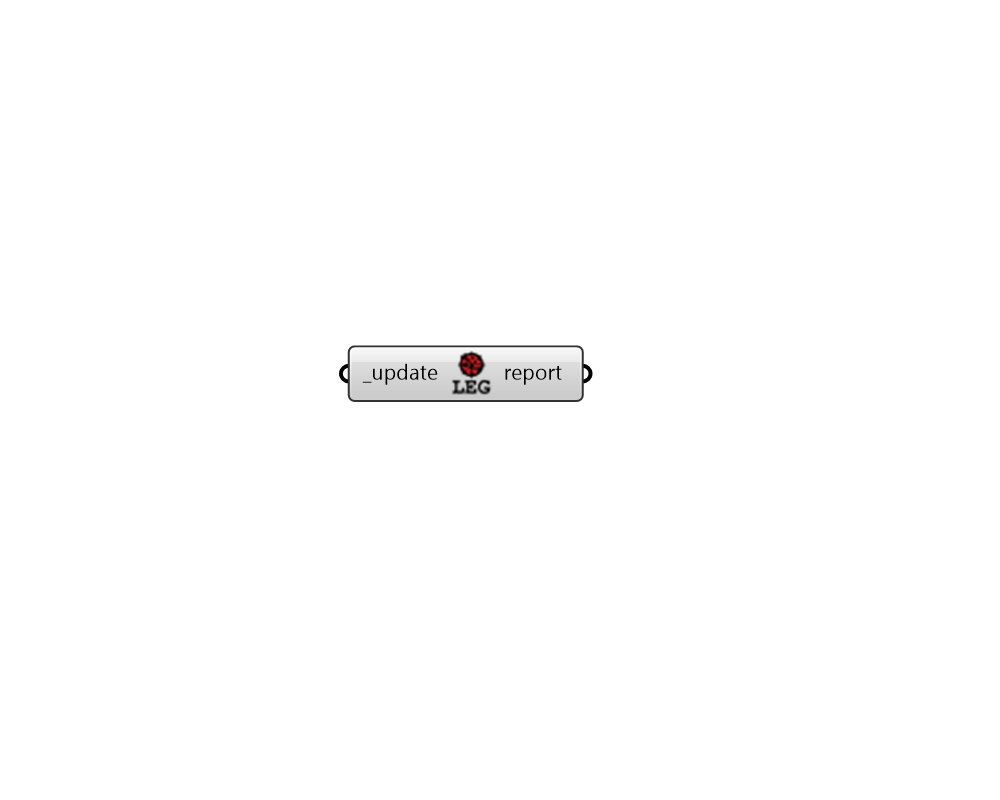

## Legacy Updater

 - [[source code]](https://github.com/ladybug-tools/ladybug-grasshopper/blob/master/ladybug_grasshopper/src//LB%20Legacy%20Updater.py)

Drop suggested Ladybug Tools components into a Grasshopper file for every Legacy Ladybug + Honeybee component on the canvas. 

All existing LBT and native Grasshopper components will be left as they are and only the Legacy components will be circled in Red and have the suggested LBT component placed next to them (if applicable). Note that, after this component runs, you must then connect the new LBT components to the others and delete the Legacy components. 

Where applicable, each red circle will have a message about how the LBT component differs from the Legacy one or if there may be a more appropirate LBT component in the future. Also note that some Legacy workflows have been heavily refactored since Legacy, meaning a different number of components may be necessary to achieve the same thing (typically fewer in LBT than Legacy, meaning some LEgacy components should be deleted without replacement). 

#### Inputs
* ##### update [Required]
Set to "True" to have this component to search through the current Grasshopper file and drop suggested Ladybug Tools components for every Legacy Ladybug + Honeybee component on the canvas. 

#### Outputs
* ##### report
Errors, warnings, etc. 