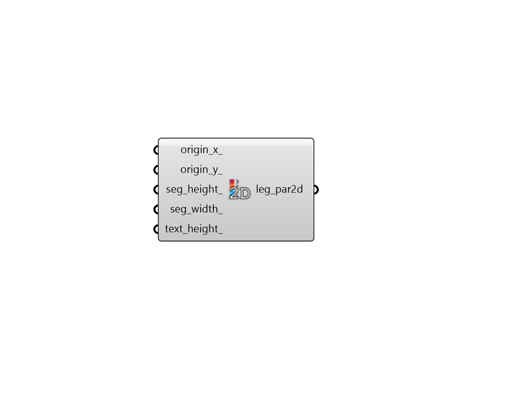

## Legend 2D Parameters

 - [[source code]](https://github.com/ladybug-tools/ladybug-grasshopper/blob/master/ladybug_grasshopper/src//LB%20Legend%202D%20Parameters.py)

Customize the properties of a screen-oreinted 2D legend displaying with the "LB Preview VisualizationSet" component. 

#### Inputs
* ##### origin_x 
An integer in pixels to note the X coordinate of the base point from where the 2D legend will be generated (assuming an origin in the upper-left corner of the screen with higher positive values of X moving to the right). Alternatively, this can be a text string ending in a % sign to denote the percentage of the screen where the X coordinate exists (eg. 5%). The default is set to make the legend clearly visible in the upper-left corner of the screen (10 pixels). 
* ##### origin_y 
An integer in pixels to note the Y coordinate of the base point from where the legend will be generated (assuming an origin in the upper-left corner of the screen with higher positive values of Y moving downward). Alternatively, this can be a text string ending in a % sign to denote the percentage of the screen where the X coordinate exists (eg. 5%). The default is set to make the legend clearly visible in the upper-left corner of the screen (50 pixels). 
* ##### seg_height 
A integer in pixels to note the height for each of the legend segments. Alternatively, this can be a text string ending in a % sign to denote the percentage of the screen (eg. 5%). The default is set to make most legends readable on standard resolution screens (25px for horizontal and 36px for vertical). 
* ##### seg_width 
An integer in pixels to set the width of each of the legend segments. Alternatively, this can be a text string ending in a % sign to denote the percentage of the screen (eg. 5%). The default is set to make most legends readable on standard resolution screens (36px for horizontal and 25px for vertical). 
* ##### text_height 
An integer in pixels to set the height for the legend text. Alternatively, this can be a text string ending in a % sign to denote the percentage of the screen (eg. 2%). 

#### Outputs
* ##### leg_par2d
A legend parameter object that can be plugged into any of the Ladybug components with a legend. 