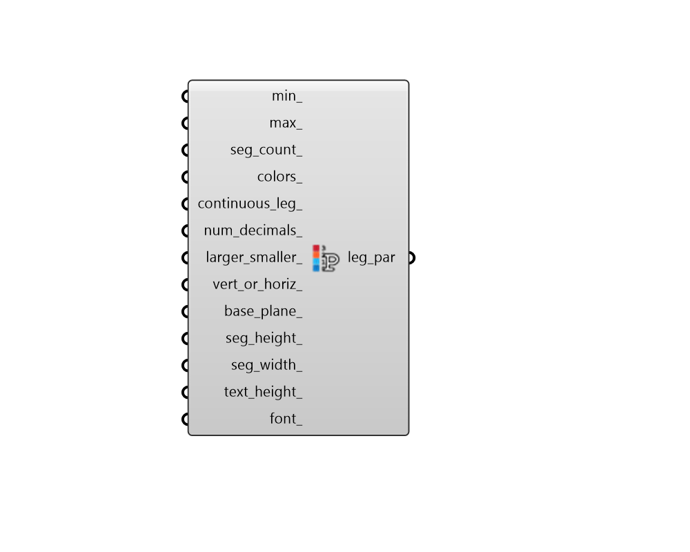

##  Legend Parameters - [[source code]](https://github.com/ladybug-tools/ladybug-grasshopper/tree/master/plugin/grasshopper/src/LadybugPlus_Legend%20Parameters.py)

Use this component to change the colors, numerical range, and/or number of divisions
 of any Ladybug legend along with the corresponding colored mesh that the legend refers to.
 Any Ladybug component that outputs a colored mesh and a legend will have an input
 that can accept Legend Parameters from this component.
 This component particularly helpful in making the colors of Ladybug graphics consistent
 for a presentation or for synchonizing the numerical range and colors between Ladybug graphics.
 -

#### Inputs
* ##### domain [Default]
A number representing the higher boundary of the legend's numerical range. The default is set to the highest value of the data stream that the legend refers to.
* ##### cType [Default]
Script variable _cType_
* ##### colors [Default]
A list of colors that will be used to re-color the legend and the corresponding colored mesh(es).  The number of colors input here should match the numSegments_ value input above.  An easy way to generate a list of colors to input here is with the Grasshopper "Gradient" component and a Grasshopper "Series" component connected to the Gradient component's "t" input.  A bunch of Grasshopper "Swatch" components is another way to generate a list of custom colors.  The default colors are a gradient spectrum from blue to yellow to red.

#### Outputs
* ##### legendPar
A legend parameters to be plugged into any of the Ladybug components with a legend.

[Check Hydra Example Files for Legend Parameters](https://hydrashare.github.io/hydra/index.html?keywords=LadybugPlus_Legend Parameters)