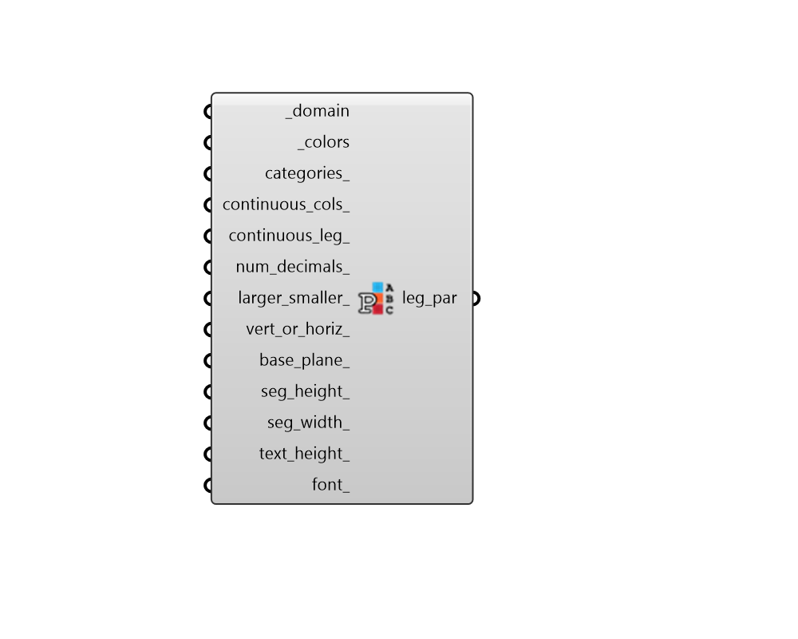

## Legend Parameters Categorized

 - [[source code]](https://github.com/ladybug-tools/ladybug-grasshopper/blob/master/ladybug_grasshopper/src//LB%20Legend%20Parameters%20Categorized.py)

Use this component to change the colors, range, and display of any Ladybug legend along with the corresponding colored mesh that the legend refers to. 

The legend parameters from this component have more limitations than the normal Legend Parameters. However, these legend parameters will do auto-categorization of data, binning values into groups based on custom ranges. 

#### Inputs
* ##### domain [Required]
A list of one or more numbers noting the bondaries of the data categories. For example, [100, 2000] creates three categories of (<100, 100-2000, >2000). Values must always be ordered from lowest to highest. 
* ##### colors [Required]
An list of color objects with a length equal to the number of items in the domain + 1. These are used to color each of the categories of data. 
* ##### categories 
An optional list of text strings with a length equal to the colors. These will be used to name each of the categories in the legend. If None, the legend text will simply mark the numerical ranges of the categories. (Default: None). 
* ##### continuous_cols 
Boolean noting whether colors generated are continuous or discrete. If True, the colors generated from the corresponding legend will be in a continuous gradient. If False, they will be categorized in incremental groups according to the segment_count. 
* ##### continuous_leg 
Boolean. If True, the colors along the legend will be in a continuous gradient. If False, they will be categorized in incremental groups according to the number_of_segments. Default is False for depicting discrete categories. 
* ##### num_decimals 
An optional integer to set the number of decimal places for the numbers in the legend text. Default is 2. 
* ##### larger_smaller 
Boolean noting whether to include larger than and smaller than (> and <) values after the upper and lower legend segment text. Default is False. 
* ##### vert_or_horiz 
Boolean. If True, the legend mesh and text points will be generated vertically.  If False, they will genrate a horizontal legend. Default is True for a vertically-oriented legend. 
* ##### base_plane 
A Plane to note the starting point and orientation from where the legend will be genrated. The default is the world XY plane at origin (0, 0, 0). 
* ##### seg_height 
An optional number to set the height of each of the legend segments. Default is 1. 
* ##### seg_width 
An optional number to set the width of each of the legend segments. Default is 1 when legend is vertical. When horizontal, the default is (text_height * (number_decimal_places + 2)). 
* ##### text_height 
An optional number to set the size of the text in model units. Default is half of the segment_height. 
* ##### font 
An optional text string to specify the font to be used for the text. Examples include "Arial", "Times New Roman", "Courier" (all without quotations). Default is "Arial". 

#### Outputs
* ##### leg_par
A legend parameter object that can be plugged into any of the Ladybug components with a legend. 