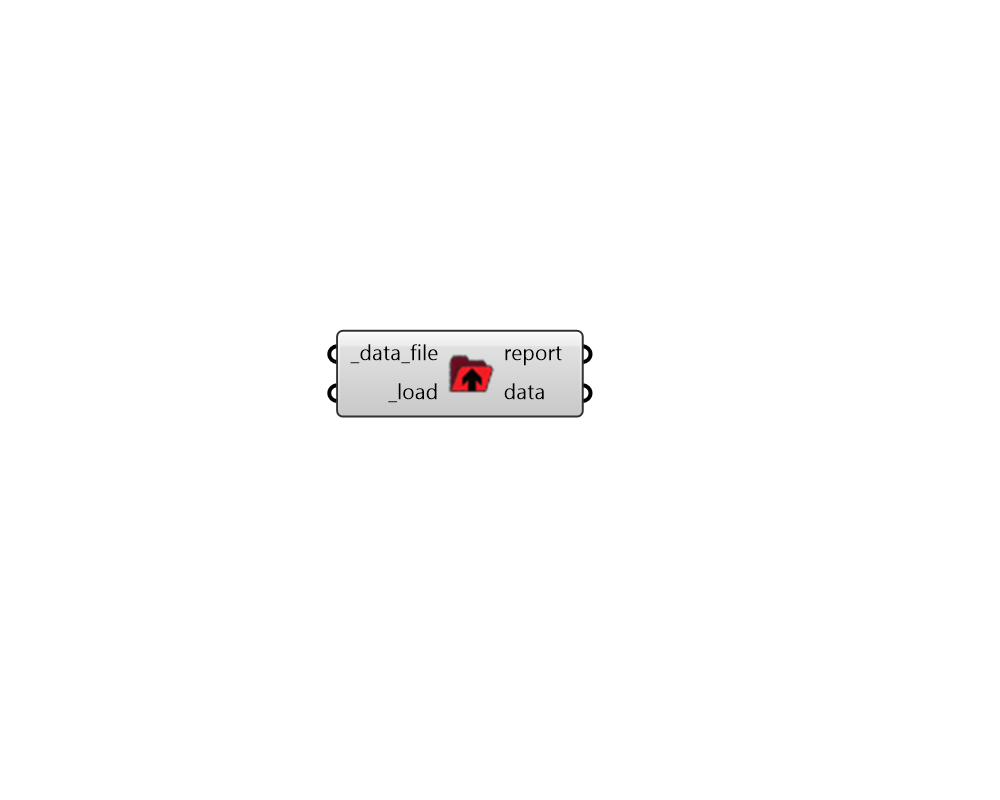

## Load Data

 - [[source code]](https://github.com/ladybug-tools/ladybug-grasshopper/blob/master/ladybug_grasshopper/src//LB%20Load%20Data.py)

Load Ladybug data collections from a CSV, JSON, or PKL file. 

#### Inputs
* ##### data_file [Required]
A file path to a CSV, JSON or PKL file from which data collections will be loaded. 
* ##### load [Required]
Set to "True" to load the data collections from the _data_file. 

#### Outputs
* ##### report
Reports, errors, warnings, etc. 
* ##### data
A list of honeybee objects that have been re-serialized from the input file. 