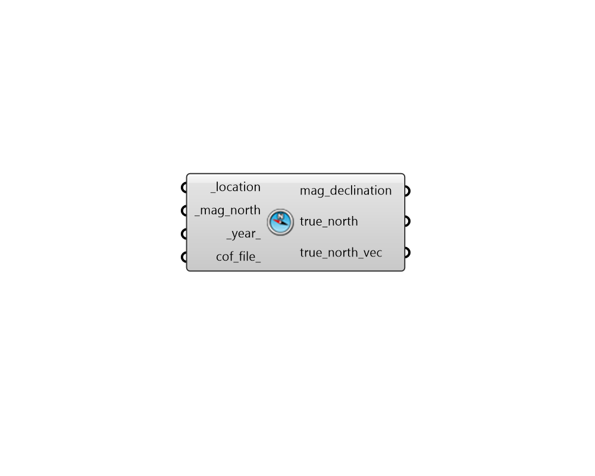

## Magnetic to True North

 - [[source code]](https://github.com/ladybug-tools/ladybug-grasshopper/blob/master/ladybug_grasshopper/src//LB%20Magnetic%20to%20True%20North.py)

Compute a True North angle and vector from Magnetic North at a given location. 

This component uses then World Magnetic Model (WMM) developed and maintained by NOAA. https://www.ncei.noaa.gov/products/world-magnetic-model 

#### Inputs
* ##### location [Required]
A ladybug Location that has been output from the "LB Import EPW" component or the "LB Construct Location" component. This is used to determine the difference between magnetic and true North. 
* ##### mag_north [Required]
A number between -360 and 360 for the counterclockwise difference between Magnetic North and the positive Y-axis in degrees. Counterclockwise means "90 is West and 270 is East". This can also be Vector for the magnetic North direction. 
* ##### year 
A number for the year in which the Magnetic North was evaluated. Decimal values are accepted. This is needed as the location of Magnetic North has been moving at a rate of roughly 50 km/year for the past couple of decades. (Default: 2025). 
* ##### cof_file 
An optional path to a .COF file containing the coefficients that form the inputs for the World Magnetic Model (WMM). A new set of coefficients is published roughly every 5 years as the magnetic poles continue to move. If unspecified, coefficients will be taken from the most recent model. COF files with the most recent coefficients and historical values are available at: 

#### Outputs
* ##### mag_declination
The magnetic declination in degrees. Magnetic declination is the difference between magnetic North and true North at a given location on the globe (expressed in terms of degrees). 
* ##### true_north
A number between -360 and 360 for the True North angle in degrees. 
* ##### true_north_vec
A vector for the True North direction. This can be plugged into any of the north_ inputs of the other LAdybug Tools components. 