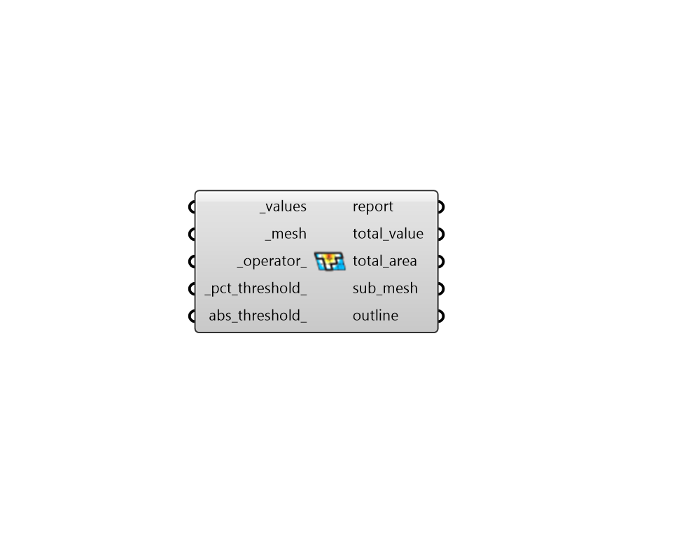

## Mesh Threshold Selector

 - [[source code]](https://github.com/ladybug-tools/ladybug-grasshopper/blob/master/ladybug_grasshopper/src//LB%20Mesh%20Threshold%20Selector.py)

Select a sub-region of a mesh using aligned values and conditional criteria. 

This has multiple uses and can be applied to any study that outputs a list of results that are aligned with a mesh. For example, quantifying the daylit area from a daylight analysis, selecting the portion of a roof with enough solar radiation for photovoltaic panels, etc. 

#### Inputs
* ##### values [Required]
A list of numbers that correspond to either the number of faces or vertices of the _mesh. 
* ##### mesh [Required]
The mesh from which a sub-region will be selected. This is typically a colored mesh output from a study. 
* ##### operator 
A text string representing an operator for the the conditional statement.  The default is greater than (>).  This must be an operator in python and examples include the following: 

    * > - Greater Than

    * < - Less Than

    * >= - Greater or Equal

    * <= - Less or Equal

    * == - Equals

    * != - Does not Equal
* ##### pct_threshold 
A number between 0 and 100 that represents the percentage of the mesh faces or vertices to be included in the resulting sub_mesh. (Default: 25%). 
* ##### abs_threshold 
An optional number that represents the absolute threshold above which a given mesh face or vertex is included in the resulting sub_mesh. An input here will override the percent threshold input above. 

#### Outputs
* ##### report
Reports, errors, warnings, etc. 
* ##### total_value
The sum of each value that meets the criteria multiplied by the corresponding mesh face area. This can generally be used to understand how much value is captured according to the conditional critera. For example, if the input _mesh is a radiation study, this is equal to the total radiation falling on the sub_mesh. This may or may not be meaningful depending on the units of the connected _values. This output will always be zero for cases where values correspond to mesh vertices and not faces. 
* ##### total_area
The area of the sub_mesh that meets the criteria. 
* ##### sub_mesh
A new mesh with the faces or vertices removed to reveal just the portion that satisfies the conditional criteria. By default, this is hidden to that just the outline appears in the geometry preview. 
* ##### outline
A set of lines outlining the portion of the mesh that is above the threshold. 