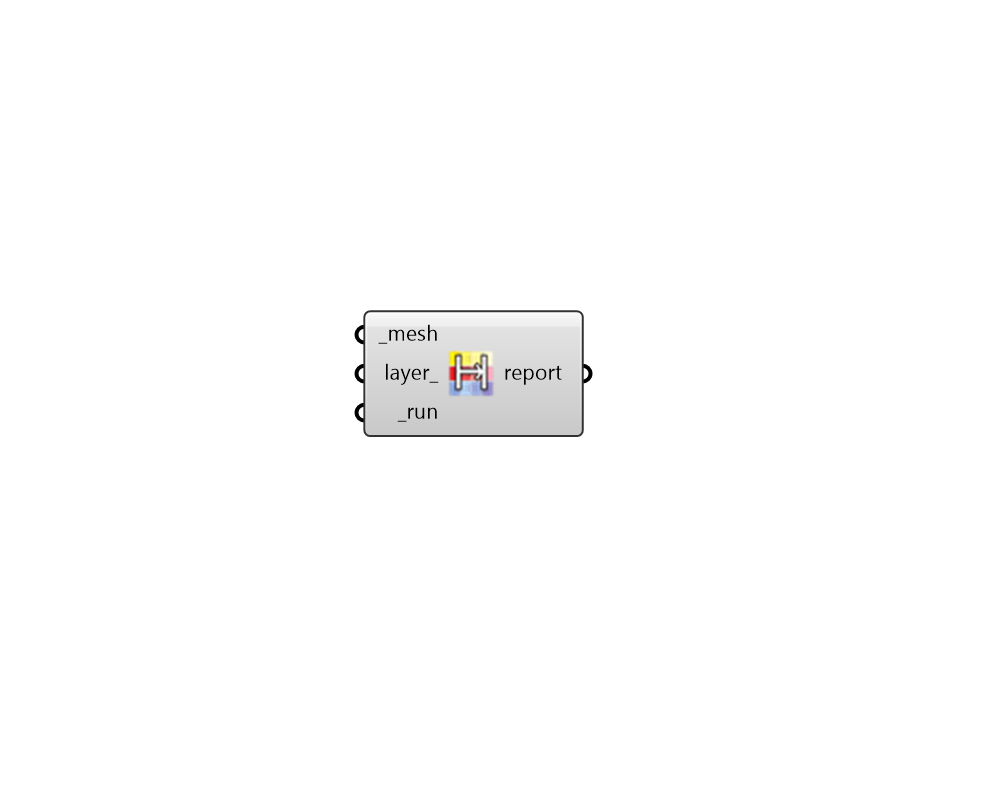

## Mesh to Hatch

 - [[source code]](https://github.com/ladybug-tools/ladybug-grasshopper/blob/master/ladybug_grasshopper/src//LB%20Mesh%20to%20Hatch.py)

Bake a clored mesh into the Rhino scene as a group of colored hatches. 

This is useful when exporting ladybug graphics from Rhino to vector-based programs like Inkscape or Illustrator since hatches are exported from Rhino as colored-filled polygons. 

#### Inputs
* ##### mesh [Required]
A colored mesh (or list of colored meshes) to be baked into the Rhino scene as groups of colored hatches. 
* ##### layer 
Text for the layer name on which the hatch will be added. If unspecified, it will be baked onto the currently active layer. 
* ##### run [Required]
Set to 'True' to bake the mesh into the scene as hatches. 

#### Outputs
* ##### report
Reports, errors, warnings ... 