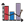
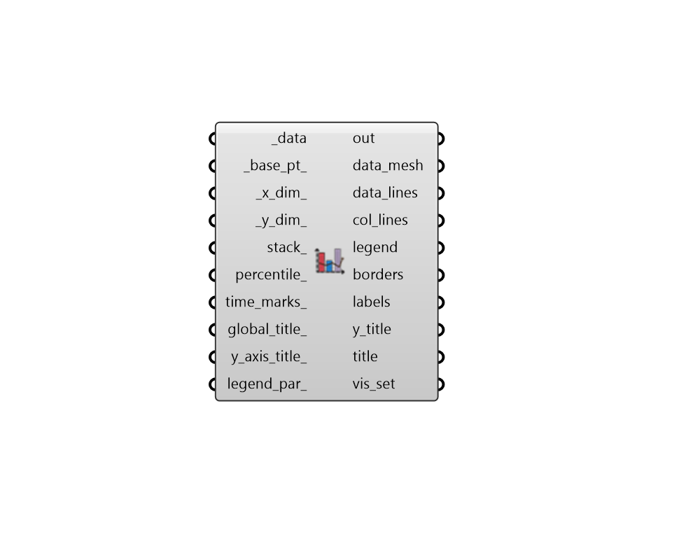

## Monthly Chart
 - [[source code]](https://github.com/ladybug-tools/ladybug-grasshopper/blob/master/ladybug_grasshopper/src//LB%20Monthly%20Chart.py)

Create a chart in the Rhino scene with data organized by month.
 

Data will display as a bar chart if the input data is monthly or daily. If the
 data is hourly or sub-hourly, it will be plotted with lines and/or a colored
 mesh that shows the range of the data within specific percentiles.
 

#### Inputs
* ##### data [Required]
Data collections (eg. HourlyCollection, MonthlyCollection, or DailyCollection), which will be used to generate the monthly chart. 
* ##### base_pt 
An optional Point3D to be used as a starting point to generate the geometry of the chart (Default: (0, 0, 0)). 
* ##### x_dim 
An optional number to set the X dimension of each month of the chart. (Default: 10 meters). 
* ##### y_dim 
An optional number to set the Y dimension of the entire chart (Default: 40 meters). 
* ##### stack 
Boolean to note whether multiple connected monthly or daily input _data with the same units should be stacked on top of each other. Otherwise, all bars for monthly/daily data will be placed next to each other.  (Default: False). 
* ##### percentile 
An optional number between 0 and 50 to be used for the percentile difference from the mean that hourly data meshes display at. For example, using 34 will generate hourly data meshes with a range of one standard deviation from the mean. Note that this input only has significance when the input data collections are hourly. (Default: 34) 
* ##### global_title 
A text string to label the entire entire chart.  It will be displayed in the lower left of the output chart.  The default will display the metadata of the input _data. 
* ##### y_axis_title 
A text string to label the Y-axis of the chart.  This can also be a list of 2 Y-axis titles if there are two different types of data connected to _data and there are two axes labels on either side of the chart.  The default will display the data type and units of the first (and possibly the second) data collection connected to _data. 
* ##### legend_par 
An optional LegendParameter object to change the display of the chart (Default: None). 

#### Outputs
* ##### report
... 
* ##### data_mesh
A list of colored meshes that represent the different input data. These meshes will resemble a bar chart in the case of monthly or daily data and will resemble a band between two ranges for hourly and sub-hourly data. Multiple lists of meshes will be output for several input data streams. 
* ##### data_lines
A list of polylines that represent the input data. These will represent the average or total at each hour whenever the input data is hourly or monthly-per-hour data. 
* ##### col_lines
A list of colored polylines that represent the input data. These will only be output when the input data are monthly per hour. 
* ##### legend
Geometry representing the legend for the chart, noting which colors correspond to which input data. 
* ##### borders
A list of lines and polylines representing the axes and intervals of the chart. 
* ##### labels
A list of text objects that label the borders with month name and the intervals of the Y-axis. 
* ##### y_title
A text oject for the Y-axis title. 
* ##### title
A text object for the global_title. 