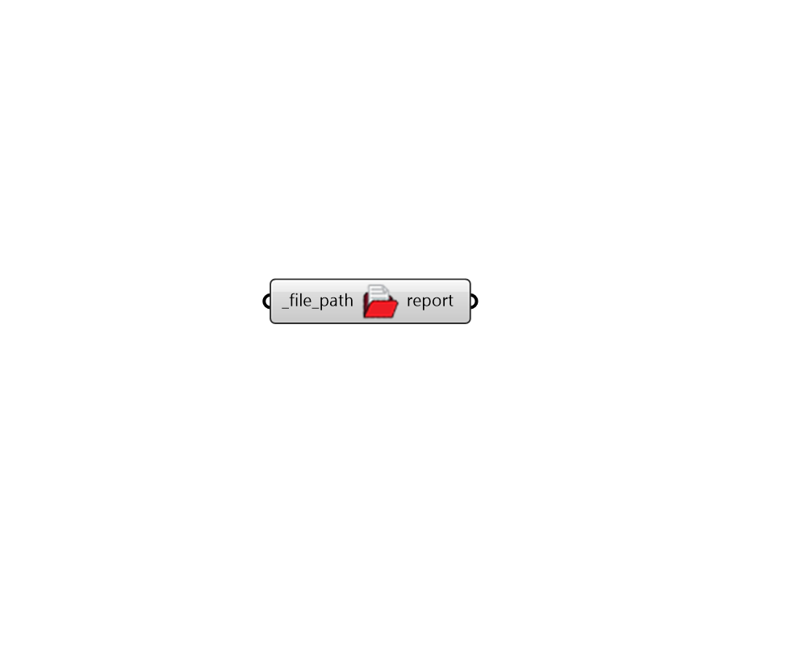

## Open File

 - [[source code]](https://github.com/ladybug-tools/ladybug-grasshopper/blob/master/ladybug_grasshopper/src//LB%20Open%20File.py)

Open a file in whatever program is associated with the file extension. This can be used to open simulation files in particular applications (eg. opening an OSM file in the OpenStudio Application). 

#### Inputs
* ##### file_path [Required]
Full path to a file to be opened. 

#### Outputs
* ##### report
Reports, errors, warnings, etc. 