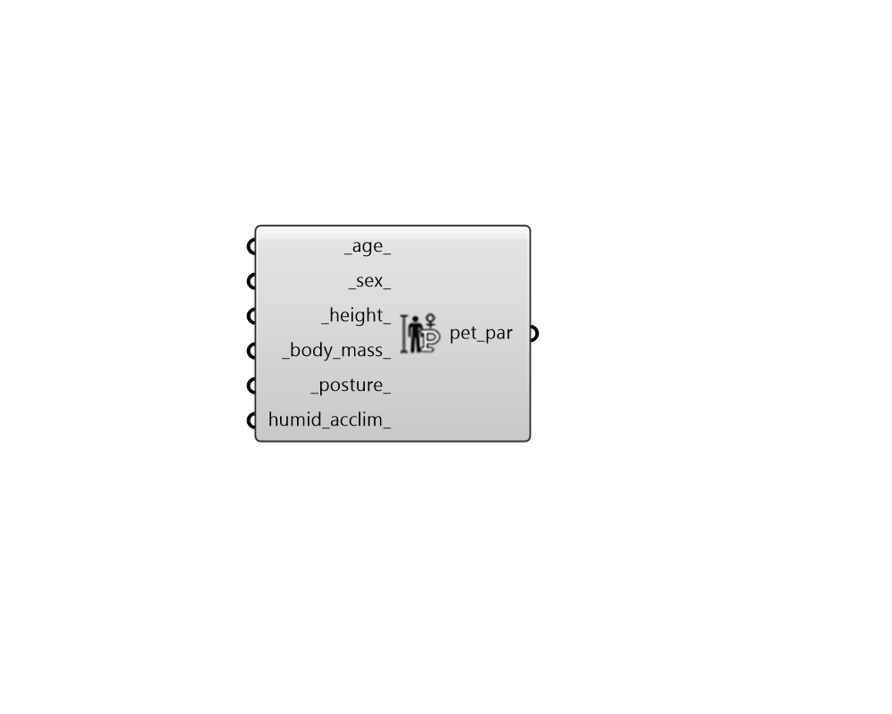

## PET Body Parameters

 - [[source code]](https://github.com/ladybug-tools/ladybug-grasshopper/blob/master/ladybug_grasshopper/src//LB%20PET%20Body%20Parameters.py)

Create a set of parameters that define the body characteristics for the PET model. 

These parameters can be plugged into any of the components that compute PET thermal comfort. 

#### Inputs
* ##### age 
The age of the human subject in years. (Default: 36 years for middle age of the average worldwide life expectancy). 
* ##### sex 
A value between 0 and 1 to indicate the sex of the human subject, which influences the computation of basal metabolism. 0 indicates male. 1 indicates female and any number in between denotes a weighted average between the two. (Default: 0.5). 
* ##### height 
The height of the human subject in meters. Average male height is around 1.75m while average female height is 1.55m. (Default: 1.65m for a worldwide average between male and female height). 
* ##### body_mass 
The body mass of the human subject in kilograms. (Default: 62 kg for the worldwide average adult human body mass). 
* ##### posture 
A text string indicating the posture of the body. Letters must be lowercase. Default is "standing". Choose from the following: 

    * standing

    * seated

    * crouching
* ##### humid_acclim 
A boolean to note whether the human subject is acclimated to a humid/tropical climate (True) or is acclimated to a temperate climate (False). When True, the categories developed by Lin and Matzarakis (2008) will be used to assess comfort instead of the original categories developed by Matzarakis and Mayer (1996). 

#### Outputs
* ##### pet_par
A PET comfort parameter object that can be plugged into any of the components that compute PET thermal comfort. 