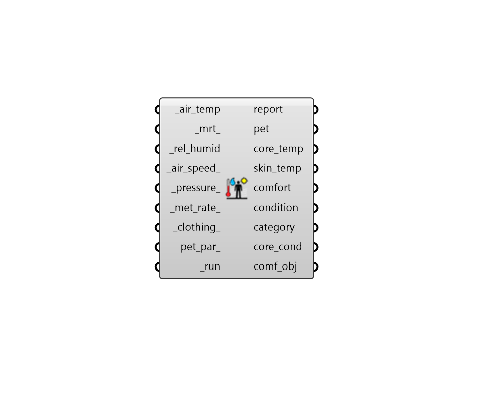

## PET Comfort

 - [[source code]](https://github.com/ladybug-tools/ladybug-grasshopper/blob/master/ladybug_grasshopper/src//LB%20PET%20Comfort.py)

Calculate Physiological Equivalent Temperature (PET). 

PET uses the Munich Energy Balance Model (MEMI), which is arguably the most detailed 3-node human energy balance model in common use today. It can account for various physiological features of the human subject, including age, sex, height, and body mass, making it one of the only models that is suitable for forecasting the thermal experience of a specific individual. This also makes it one of the better models for estimating core body temperature and whether a given set of conditions is likely to induce hypothermia or hyperthermia in a specific individual. 

#### Inputs
* ##### air_temp [Required]
Data Collection or individual value for air temperature in C. 
* ##### mrt 
Data Collection or individual value of mean radiant temperature (MRT) in C. Default is the same as the air_temp. 
* ##### rel_humid [Required]
Data Collection or individual value for relative humidity in %. Note that percent values are between 0 and 100. 
* ##### air_speed 
Data Collection or individual value for air speed in m/s. Default is a very low speed of 0.1 m/s, which is typical of the room air speeds induced by HVAC systems. 
* ##### pressure 
A value or data collection representing atmospheric pressure [Pa] Default is to use air pressure at sea level (101,325 Pa). 
* ##### met_rate 
Data Collection or individual value of metabolic rate in met. Note that the original PET model requires that the activity of the human subject be accounted for as additional Watts above the basal metabolism, which is often difficult to estimate. In order to accept an input in [met], it is assumed that 1 met refers to Resting Metabolic Rate (RMR) and this is 1.17 times the male Basal Metabolic Rate (BMR) or 1.22 times the female BMR. Default is set to 2.4 met for walking. Typical values include the following. 

    * 1 met = Metabolic rate of a resting seated person

    * 1.2 met = Metabolic rate of a standing person

    * 2.4 met = Metabolic rate of a person walking at ~1 m/s (2 mph)
* ##### clothing 
Data Collection or individual value of clothing insulation in clo. Default is set to 0.7 clo for long sleeve shirt and pants. Typical values include the following. 

    * 1 clo = Three-piece suit

    * 0.5 clo = Shorts + T-shirt

    * 0 clo = No clothing
* ##### pet_par 
Optional comfort parameters from the "LB PET Body Parameters" component to specify the body properties of the human subject. This includes the age, height, sex, body mass, and more. The default attempts to model as average of a human body as possible. 
* ##### run [Required]
Set to True to run the component. 

#### Outputs
* ##### report
Reports, errors, warnings, etc. 
* ##### pet
Physiological Equivalent Temperature (PET) [C]. PET is a "feels like" temperature value and is defined as the operative temperature of a reference environment that would cause the same physiological response in the human subject as the environment under study. That is, the same skin temperature and core body temperature. 
* ##### core_temp
The core body temperature of the human subject [C]. 
* ##### skin_temp
The skin temperature of the human subject underneath the clothing layer [C]. 
* ##### comfort
Integers noting whether the input conditions result in no thermal stress (aka. they are comfortable. 
Values are one of the following: 

    * 0 = uncomfortable

    * 1 = comfortable
* ##### condition
Integers noting the thermal status of a subject. 
Values are one of the following: 

    * -1 = cold

    *  0 = netural

    * +1 = hot
* ##### category
Integers noting the thermal status on a nine-point scale. 
Values are one of the following: 

    * -4 = very strong/extreme cold stress

    * -3 = strong cold stress

    * -2 = moderate cold stress

    * -1 = slight cold stress

    * 0 = no thermal stress

    * +1 = slight heat stress

    * +2 = moderate heat stress

    * +3 = strong heat stress

    * +4 = very strong/extreme heat stress
* ##### core_cond
Integers noting the classification of core body temperature. 
Values are one of the following: 

    * -2 = Hypothermia

    * -1 = Cold

    * 0 = Normal

    * +1 = Hot

    * +2 = Hyperthermia
* ##### comf_obj
A Python object containing all inputs and results of the analysis.  This can be plugged into components like the "Comfort Statistics" component to get further information. 