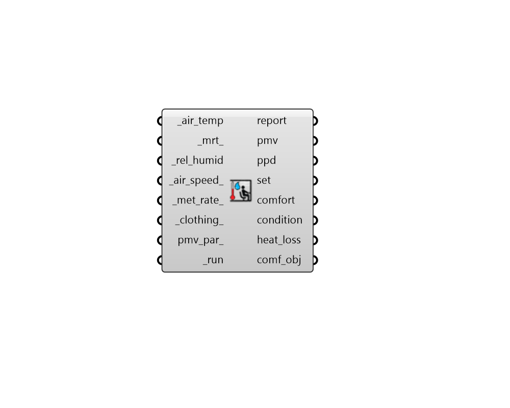

## PMV Comfort
 - [[source code]](https://github.com/ladybug-tools/ladybug-grasshopper/blob/master/ladybug_grasshopper/src//LB%20PMV%20Comfort.py)

Calculate Predicted Mean Vote (PMV).
 

PMV is a thermal comfort model for use on the interior of buildings
 where a heating or cooling system is operational.
 Note that, for naturally ventilated buildings, the Adaptive thermal
 comfort model should be used.
 

#### Inputs
* ##### air_temp [Required]
Data Collection or individual value of air temperature in C. 
* ##### mrt 
Data Collection or individual value of mean radiant temperature (MRT) in C. Default is the same as the air_temp.. 
* ##### rel_humid [Required]
Data Collection or individual value of relative humidity in %. 
* ##### air_speed 
Data Collection or individual of air speed values in m/s. Default is a very low speed of 0.1 m/s. 
* ##### met_rate 
Data Collection or individual value of metabolic rate in met. Default is set to 1.1 met for seated, typing. Typical values include the following. 

    * 1 met = Metabolic rate of a resting seated person

    * 1.2 met = Metabolic rate of a standing person

    * 2.4 met = Metabolic rate of a person walking at ~1 m/s (2 mph)
* ##### clothing 
Data Collection or individual value of clothing insulation in clo. Default is set to 0.7 clo for long sleeve shirt and pants. Typical values include the following. 

    * 1 clo = Three-piece suit

    * 0.5 clo = Shorts + T-shirt

    * 0 clo = No clothing
* ##### pmv_par 
Optional comfort parameters from the "LB PMV Comfort Parameters" component to specify the criteria under which conditions are considered acceptable/comfortable. The default will assume a PPD threshold of 10% and no absolute humidity constraints. 
* ##### run [Required]
Set to True to run the component. 

#### Outputs
* ##### report
Reports, errors, warnings, etc. 
* ##### pmv
Predicted Mean Vote (PMV). 
PMV is a seven-point scale from cold (-3) to hot (+3) that was used in comfort surveys of P.O. Fanger. 
Each interger value of the scale indicates the following: 

    * -3 = Cold

    * -2 = Cool

    * -1 = Slightly Cool

    *  0 = Neutral

    * +1 = Slightly Warm

    * +2 = Warm

    * +3 = Hot
* ##### ppd
Percentage of People Dissatisfied (PPD). 
Specifically, this is defined by the percent of people who would have a PMV beyond acceptable thresholds (typically <-0.5 and >+0.5). Note that, with the PMV model, the best possible PPD achievable is 5% and most standards aim to have a PPD below 10%. 
* ##### set
Standard Effective Temperature (SET) in Celcius. 
These temperatures describe what the given input conditions "feel like" in relation to a standard environment of 50% relative humidity, <0.1 m/s average air speed, and mean radiant temperature equal to average air temperature, in which the total heat loss from the skin of an imaginary occupant with an activity level of 1.0 met and a clothing level of 0.6 clo is the same as that from a person in the actual environment. 
* ##### comfort
Integers noting whether the input conditions are acceptable according to the assigned comfort_parameter. 
Values are one of the following: 

    * 0 = uncomfortable

    * 1 = comfortable
* ##### condition
Integers noting the thermal status of a subject according to the assigned comfort_parameter. 
Values are one of the following: 

    * -1 = cold

    *  0 = netural

    * +1 = hot
Additionally, if pmv_par_ are connected with humidity ratio lmits, the following values may also be included: 

    * -2 = too dry (but thermally neutral)

    * +2 = too humid (but thermally neutral)
* ##### heat_loss
A list of 6 terms for heat loss from the human energy balance calculation that underlies PMV. Valeus are in W. 
The terms are ordered as follows: 

    - Conduction

    - Sweating

    - Latent Respiration

    - Dry Respiration

    - Radiation

    - Convection
* ##### comf_obj
A Python object containing all inputs and results of the analysis.  This can be plugged into components like the "Comfort Statistics" component to get further information. 