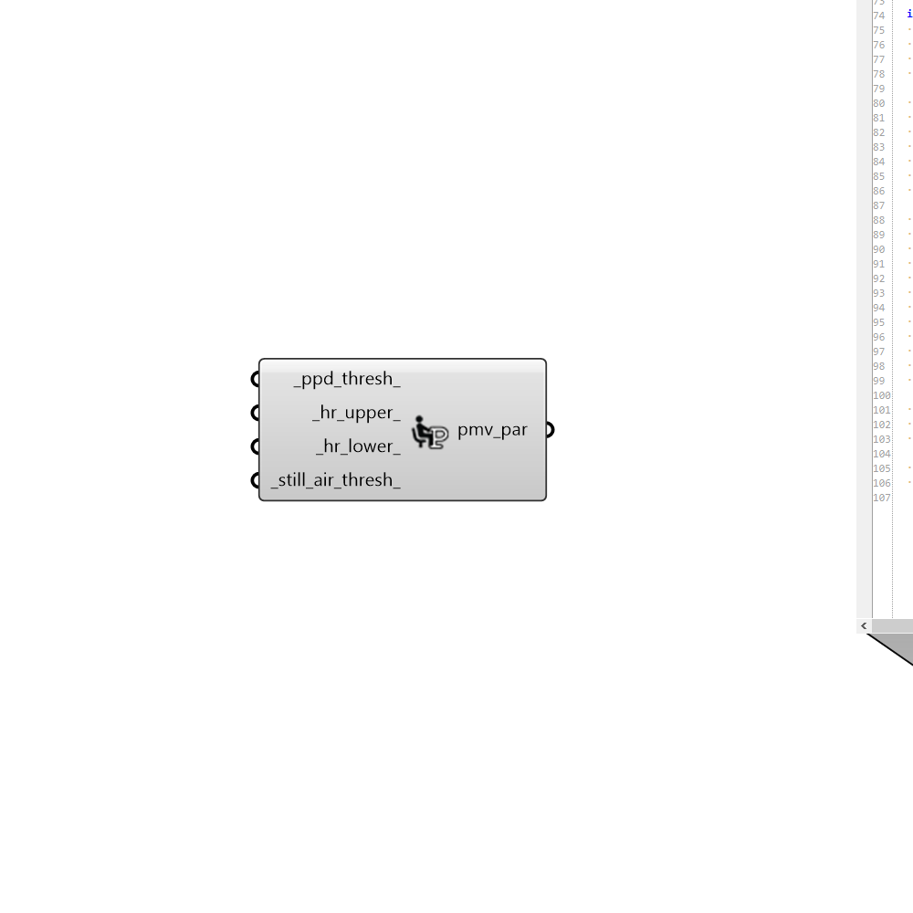

## PMV Comfort Parameters
 - [[source code]](https://github.com/ladybug-tools/ladybug-grasshopper/blob/master/ladybug_grasshopper/src//LB%20PMV%20Comfort%20Parameters.py)

Create a set of parameters that define the acceptable conditions of the
 Predicted Mean Vote (PMV) thermal comfort model.
 

These parameters can be plugged into any of the components that compute
 PMV thermal comfort.
 

#### Inputs
* ##### ppd_thresh 
A number between 5 and 100 that represents the upper threshold of PPD that is considered acceptable. Default is 10, which charcterizes most buildings in the ASHRAE-55 and EN-15251 standards. 
* ##### hr_upper 
A number between 0 and 1 indicating the upper limit of humidity ratio that is considered acceptable. Default is 1 for essentially no limit. 
* ##### hr_lower 
A number between 0 and 1 indicating the lower limit of humidity ratio considered acceptable. Default is 0 for essentially no limit. 
* ##### still_air_thresh 
The air speed threshold in m/s at which the standard effective temperature (SET) model will be used to correct for the cooling effect of elevated air speeds. Default is 0.1 m/s, which is the limit according to ASHRAE-55. 

#### Outputs
* ##### pmv_par
A PMV comfort parameter object that can be plugged into any of the components that compute PMV thermal comfort. 