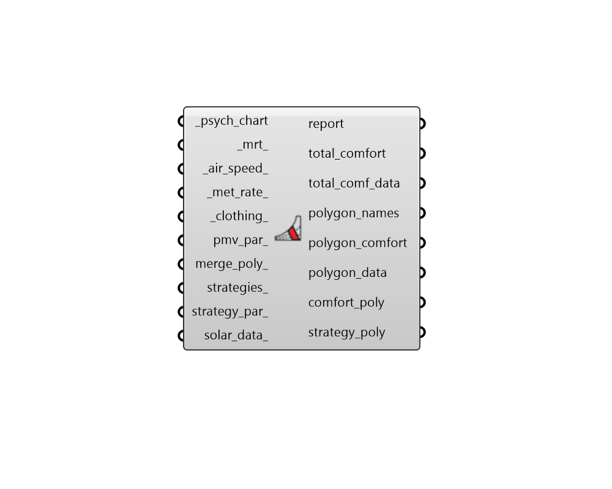

## PMV Polygon

 - [[source code]](https://github.com/ladybug-tools/ladybug-grasshopper/blob/master/ladybug_grasshopper/src//LB%20PMV%20Polygon.py)

Draw thermal comfort polygons on a Psychrometric Chart using the PMV model for indoor thermal comfort. 

This component can also plot passive strategy polygons on the psychrometric chart and can compute the number of hours that lie inside each of the comfort / strategy polygons. 

#### Inputs
* ##### psych_chart [Required]
A hourly, daily, or sub-hourly data collection of temperature values or a single temperature value in Celcius to be used for the whole analysis. If this input data collection is in in Farenheit, the entire chart will be drawn using IP units. Operative temperature should be used if it is available. Otherwise, air temperature (aka. dry bulb temperature) is suitable. 
* ##### mrt 
A number or list of numbers for the mean radiant temperature. These should be in Celsius if the Psychrometric Chart is in SI and Farenheit if the Psychrometric Chart is in IP. If None, a polygon for operative temperature will be plot, assuming that radiant temperature and air temperature are the same. (Default: None). 
* ##### air_speed 
A number or list of numbers for the air speed values in m/s. If None, a low air speed of 0.1 m/s wil be used for all polygons. (Default: None). 
* ##### met_rate 
A number or list of numbers for the metabolic rate in met. If None, a met rate of 1.1 met will be used for all polygons, indicating a human subject who is seated, typing. (Default: None). 
* ##### clothing 
A number or list of numbers for the clothing level in clo. If None, a clo level of 0.7 clo will be used for all polygons, indicating a human subject with a long sleeve shirt and pants. (Default: None). 
* ##### pmv_par 
Optional PMVParameter object to specify parameters under which conditions are considered acceptable. If None, default will assume a PPD threshold of 10%, no absolute humidity constraints and a still air threshold of 0.1 m/s. 
* ##### merge_poly 
Boolean to note whether all comfort polygons should be merged into a single polygon instead of separate polygons for each set of input conditions. (Default: False). 
* ##### strategies 
An optional text input of passive strategies to be plot on the psychrometric chart as polygons.  It is recommended that the "LB Passive Strategy" component be used to select which polygons to plot. 
* ##### strategy_par 
Optional passive strategy parameters from the "LB Passive Strategy Parameters" component. This can be used to adjust various inputs used to generate strategy polygons including the maximum comfortable air speed, the building balance temperature, and the temperature limits for thermal mass and night flushing. 
* ##### solar_data 
An annual hourly continuous data collection of irradiance (or radiation) in W/m2 (or Wh/m2) that aligns with the data points on the psychrometric chart. This is only required when plotting a "Passive Solar Heating" strategy polygon on the chart. The irradiance values should be incident on the orientation of the passive solar heated windows. So using global horizontal radiation assumes that all windows are skylights (like a greenhouse). The "LB Directional Irradiance" component can be used to get irradiance data for a specific surface orientation. 

#### Outputs
* ##### report
... 
* ##### total_comfort
The percent of the data on the psychrometric chart that are inside all comfort and passive strategy polygons. 
* ##### total_comf_data
Data collection or a 0/1 value noting whether each of the data points on the psychrometric chart lies inside of a comfort polygon or a strategy polygon. 
This can be connected to the "LB Create Legend" component to generate a list of colors that can be used to color the points output from "LB Psychrometric Chart" component to see exactly which points are comfortable and which are not. 
Values are one of the following: 0 = uncomfortable 1 = comfortable 
* ##### polygon_names
A list of names for each of the polygons. This will include both the comfort polygons and the passive strategy polygons. The order of these names correspondsto the total_strategies and strategies_data outputs. 
* ##### polygon_comfort
The percent of the input data that are in each of the comfort or passive strategy polygons. Each number here corresponds to the names in the polygon_names output above. 
* ##### polygon_data
A list of data collections or 0/1 values indicating whether each  of the data points on the psychrometric chart lies inside each of the comfort or a strategy polygons. Each data collection or here corresponds to the names in the polygon_names output above. 
Values are one of the following: 0 = uncomfortable 1 = comfortable 
* ##### comfort_poly
Brep representing the range of comfort for the input mrt, air speed, metabolic rate and clothing level. IF multiple values have been input, multiple polygons will be output here. 
* ##### strategy_poly
Brep representing the area of the chart made comfortable by any input passive strategies. If multiple strategies have been input to the strategies_ input, multiple polygons will be output here. 