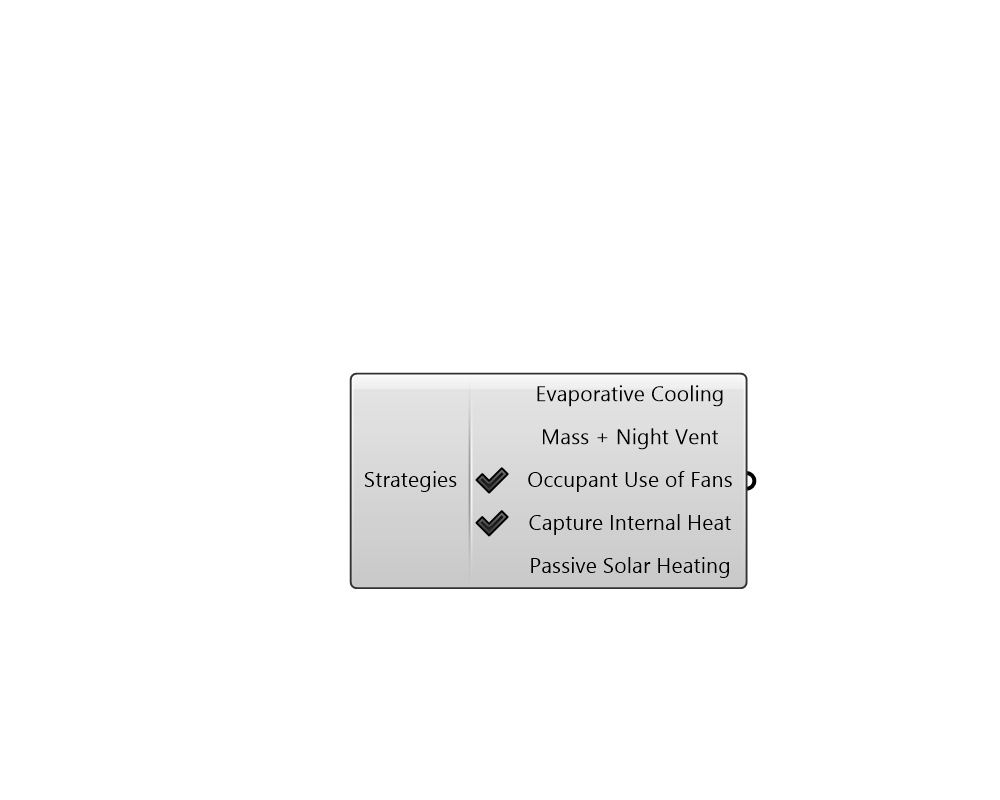

## Passive Strategies

 - [[source code]](https://github.com/ladybug-tools/ladybug-grasshopper/blob/master/ladybug_grasshopper/src//LB%20Passive%20Strategies.py)

Provides a list of passive thermal strategies to be plugged into the "LB PMV Polygon" component. 