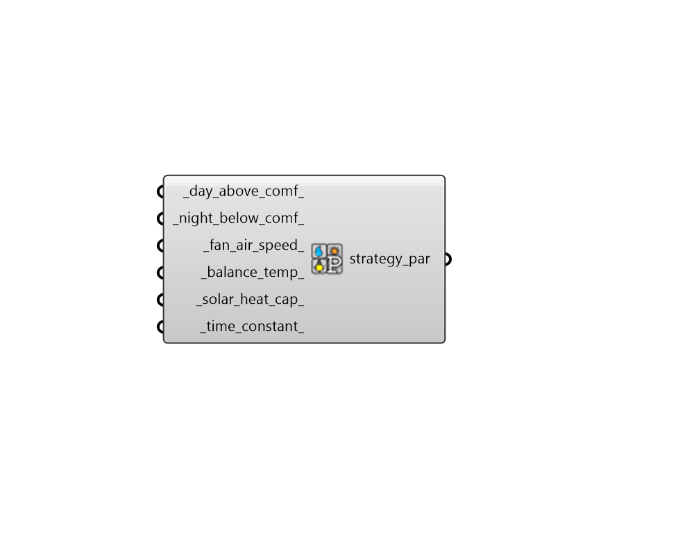

##  Passive Strategy Parameters - [[source code]](https://github.com/ladybug-tools/ladybug-grasshopper/blob/master/ladybug_grasshopper/src//LB%20Passive%20Strategy%20Parameters.py)

Adjust the assumptions of the passive strategies that can be overalid on the
 Psychrometric Chart using the "LB PMV Polygon" component. The default assumptions
 of each of the strategies are as follows: 
 

Thermal Mass + Night Vent - The polygon represents the conditions under which
 shaded, night-flushed thermal mass can keep occupants cool. By default, this
 polygon assumes that temperatures can get as high as 12 C above the max temperature
 of the comfort polygon as long temperatures 8 hours before the hot hour are
 3.0 C lower than the max temperture of the comfort polygon. This parameter
 component can be used to adjust these two temperature values and the number of
 hours that the building keeps its "coolth".
 

Occupant Use of Fans - This polygon is made by assuming that an air speed of 1.0 m/s
 is the maximum speed tolerable before papers start blowing around and conditions
 become annoying to occupants. The polygon is determined by running a PMV model
 with this fan air speed and the PMV inputs of the warmest comfort conditions.
 This parameter component can be used to adjust this maximum acceptable air speed.
 

Capture Internal Heat - The polygon is made by assuming a minimum building balance
 point of 12.8 C and any conditions that are warmer than that will keep occupants
 comfortable (up to the comfort polygon). It is assumed that, above this building
 balance temperature, the building is free-running and occupants are able to open
 windows as they wish to keep conditions from overshooting the comfort polygon.
 Note that the default balance temperature of 12.8 C is fairly low and assumes a
 significant amount of internal heat from people, equipment. etc. Or the building 
 as a well-insulated envelope to ensure what internal heat there is can leave the
 building slowly. This parameter component can be used to adjust the balance
 temperature.
 

Passive Solar Heating - The polygon represents the conditions under which
 sun-exposed thermal mass can keep occupants warm in winter. By default, this
 polygon assumes that temperatures can get as high as 12 C above the max temperature
 of the comfort polygon as long temperatures 8 hours before the hot hour are
 3.0 C lower than the max temperture of the comfort polygon. This parameter
 component can be used to adjust these two temperature values and the number of
 hours that the building keeps its "coolth".
 

#### Inputs
* ##### day_above_comf 
A number in degrees Celsius representing the maximum daily temperature above the comfort range which can still be counted in the "Mass + Night Vent" polygon. (Default: 12 C). 
* ##### night_below_comf 
A number in degrees Celsius representing the minimum temperature below the maximum comfort polygon temperature that the outdoor temperature must drop at night in order to count towards the "Mass + Night Vent" polygon. (Default: 3C). 
* ##### fan_air_speed 
The air speed around the occupants that the fans create in m/s. This is used to create the "Occupant Use of Fans" polygon. Note that values above 1 m/s tend to blow papers off desks. (Default: 1.0 m/3) 
* ##### balance_temp 
The balance temperature of the building in Celsius when accounting for all internal heat. This is used to create the "Capture Internal Heat" polygon. This value must be greater or equal to 5 C (balance temperatures below 10 C are exceedingly rare) and it should be less than the coldest temperature of the merged comfort polygon in order to be meaningful. (Default: 12.8 C) 
* ##### solar_heat_cap 
A number representing the amount of outdoor solar flux (W/m2) that is needed to raise the temperature of the theoretical building by 1 degree Celsius. The lower this number, the more efficiently the space is able to absorb passive solar heat. The default assumes a relatively small passively solar heated zone without much mass. A higher number will be required the larger the space is and the more mass that it has. (Default: 50 W/m2) 
* ##### time_constant 
A number that represents the amount of time in hours that a therortical building can passively maintain its temperature. This is used to determine how many hours a space can maintain a cool temperature after night flushing for the "Mass + Night Vent" polygon. It is also used to determine how many hours a space can store solar radiation for the "Passive Solar Heating" polygon. The default assumes a relatively well-isulated building with a thermal mass typical of most contemporary buildings. Higher mass buildings will be able to support a longer time constant. (Default: 8 hours). 

#### Outputs
* ##### strategy_par
Passive strategy parameters that can be plugged into the "LB PMV Polygon" to adjust the assumptions of the passive strategy polygons.