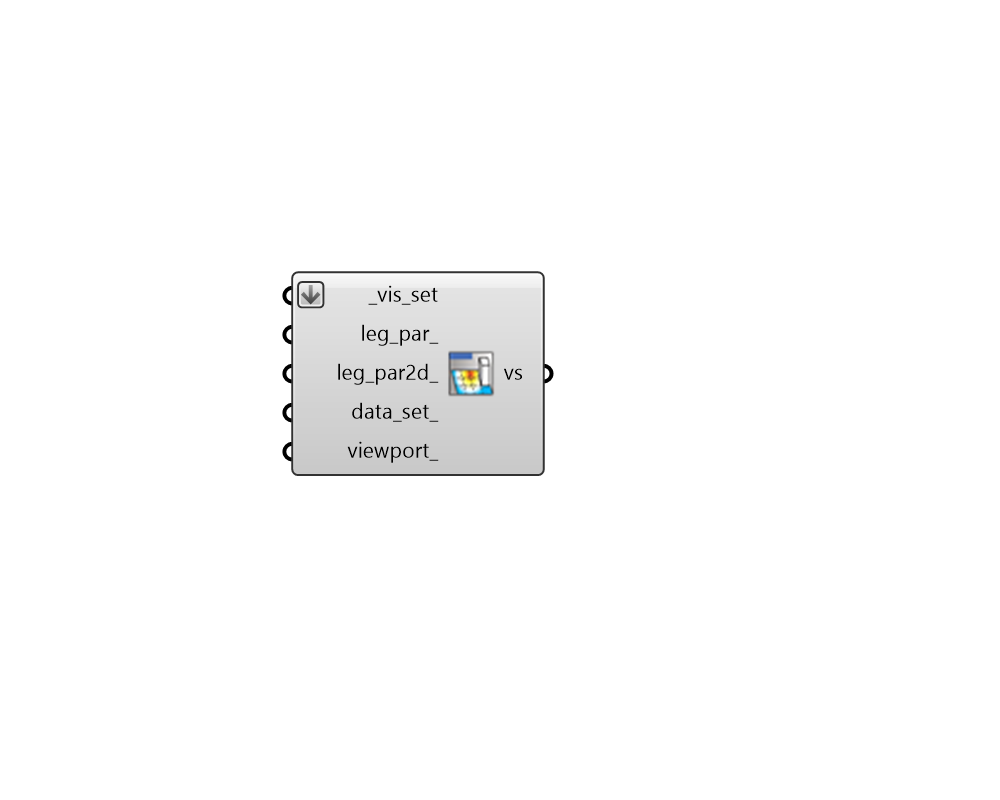
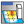

## Preview VisualizationSet

 - [[source code]](https://github.com/ladybug-tools/ladybug-grasshopper/blob/master/ladybug_grasshopper/src//LB%20Preview%20VisualizationSet.py)

Preview a VisualizationSet from any component with a vis_set output. 

The VisualizationSet is often a much more detailed view of the geometry that the component typically generates and includes features like recommended line weights/types, display modes (eg. wireframe vs. shaded), transparency, and more. 

#### Inputs
* ##### vis_set [Required]
VisualizationSet arguments from any Ladybug Tools component with a vis_set output. This can also be the path to a .vsf file that exists on this machine (these files are often written with the "LB Dump VisualizationSet" component). Lastly, this input can be a custom VisualizationSet that has been created with the Ladybug Tools SDK. 
* ##### leg_par 
Script variable VisSet 
* ##### leg_par2d 
Optional 2D LegendParameters from the "LB Legend Parameters 2D" component, which will be used to customize a legend in the plane of the screen so that it functions like a head-up display (HUD). If unspecified, the VisualizationSet will be rendered with 3D legends in the Rhino scene much like the other native Ladybug Tools components. 
* ##### data_set 
Optional text or an integer to select a specific data set from analysis geometries within the Visualization Set. Note that this input only has meaning for Visualization Sets that contain multiple data sets assigned to the same geometry. When using an integer, this will refer to the index of the data set to be visualized (starting with 0). When using text, this will refer to the name of the data type for the data set to be displayed. 

#### Outputs
* ##### vs
A VisualizationSet object that can be baked into the Rhino document by running "Bake" on this component or written to a standalone file using the "LB Dump VisualizationSet" component. 