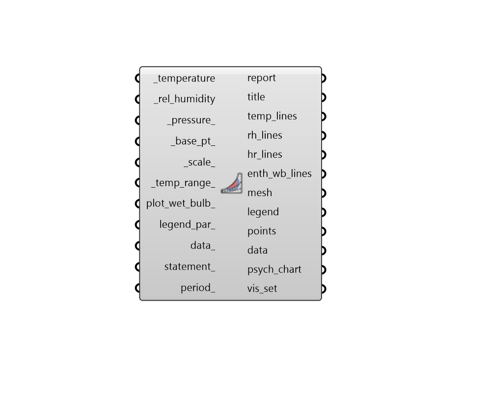

## Psychrometric Chart
 - [[source code]](https://github.com/ladybug-tools/ladybug-grasshopper/blob/master/ladybug_grasshopper/src//LB%20Psychrometric%20Chart.py)

Draw a psychrometric chart in the Rhino scene and plot a set of temperatures and
 humidity values on it.
 

Connected data can be either outdoor temperature and humidty from imported EPW
 weather data or indoor temperature and humidity ratios from an energy simulation.
 

#### Inputs
* ##### temperature [Required]
A hourly, daily, or sub-hourly data collection of temperature values or a single temperature value in Celcius to be used for the whole analysis. If this input data collection is in in Farenheit, the entire chart will be drawn using IP units. Operative temperature should be used if it is available. Otherwise, air temperature (aka. dry bulb temperature) is suitable. 
* ##### rel_humidity [Required]
A hourly, daily, or sub-hourly data collection of relative humidity values in % or a single relative humidity value to be used for the whole analysis. Note that the input data collection here must align with the _temperature input. 
* ##### pressure 
A data collection of atmospheric pressure in Pascals or a single number for the average air pressure across the data plotted on the chart. It is recommended that the barometric pressure from the "Import EPW" component be used here as the default is not sutiable for higher elevations. (Default: 101325 Pa; pressure at sea level). 
* ##### base_pt 
A point to be used as the bottom-left-most point from which all geometry of the plot will be generated. (Default: (0, 0, 0)). 
* ##### scale 
A number to set the dimensions of the chart. (Default: 1). 
* ##### temp_range 
An optional domain (or number for the upper temperature), which will be used to set the lower and upper boundaries of temperature on the psychrometric chart. (Default: -20 to 55 when the chart is in SI; -5 to 115 when the chart is in IP). 
* ##### plot_wet_bulb 
Boolean to note whether the psychrometric chart should be ploted with lines of constant enthalpy (False) or lines of constant wet bulb temperature (True).  (Default: False). 
* ##### legend_par 
An optional LegendParameter object from the "LB Legend Parameters" component to change the display of the Pyschrometric Chart. 
* ##### data 
Optional data collections, which are aligned with the input _temperature and _rel_humidity, which will be output from the data of this component and can be used to color points with data. This data can also be used along with the statement_ below to select out data that meets certain conditions. 
* ##### statement 
A conditional statement as a string (e.g. a > 25). 
The variable of the first data collection should always be named 'a' (without quotations), the variable of the second list should be named 'b', and so on. 
For example, if three data collections are connected to _data and the following statement is applied: '18 < a < 26 and b < 80 and c > 2' The resulting collections will only include values where the first data collection is between 18 and 26, the second collection is less than 80 and the third collection is greater than 2. 
For this component, temperature will always be the second-to-last letter and relative humidity will be the last letter. 
* ##### period 
A Ladybug analysis period to be applied to the _temperature and _rel_humidity of the input data_. 

#### Outputs
* ##### report
... 
* ##### title
Text objects for the chart title and axes titles as well as a polyline for the outer border of the chart. Note that the polyline for the border excludes the saturation line. 
* ##### temp_lines
A list of line segments and text objects for the temperature labels on the chart. 
* ##### rh_lines
A list of curves and text objects for the relative humidity labels on the chart. 
* ##### hr_lines
A list of line segments and text objects for the humidty ratio labels on the chart. 
* ##### enth_wb_lines
A list of line segments and text objects for the enthalpy or wet bulb temperature labels on the chart. 
* ##### mesh
A colored mesh showing the number of input hours that happen in each part of the psychrometric chart. 
* ##### legend
A colored legend showing the number of hours that correspond to each color. 
* ##### points
Points representing each of the input temperature and humidity values. By default, this ouput is hidden and it should be connected it to a native Grasshopper preview component to view it. 
* ##### data
The input data_ with the input statements or the periods applied to it. These can be deconstructed with the "LB Deconstruct Data" component and the resulting values can be plugged into the "LB Create Legend" component to generate colors that can be used to color the points above using the native Grasshopper "Custom Preview" component. 
* ##### psych_chart
A Psychrometric Chart object, which can be connected to any of the "Comfort Polygon" components in order to plot polygons on the chart and perform thermal comfort analyses on the data. 