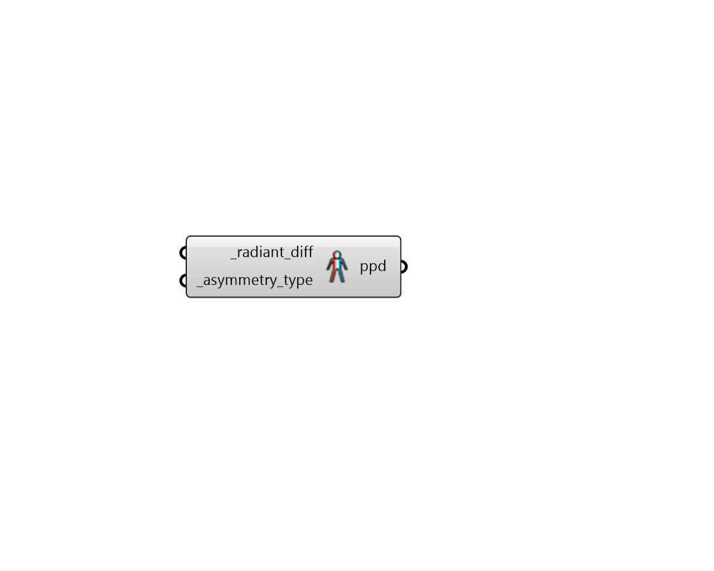

## Radiant Asymmetry

 - [[source code]](https://github.com/ladybug-tools/ladybug-grasshopper/blob/master/ladybug_grasshopper/src//LB%20Radiant%20Asymmetry.py)

Calculate the percentage of people dissatisfied from radiant asymmetry. 

The comfort functions used here come from Figure 5.2.4.1 of ASHRAE 55 2010. Note that, if the resulting input results in a PPD beyond what is included in this Figure, the maximum PPD will simply be returned. 

#### Inputs
* ##### radiant_diff [Required]
A number for the the radiant temperature difference between two sides of the same plane where an occupant is located [C]. This can also be a data collection representing the radiant temperature difference over time [C]. 
* ##### asymmetry_type [Required]
Text or an integer that representing the type of radiant asymmetry being evaluated. Occupants are more sensitive to warm ceilings and cool walls than cool ceilings and warm walls. Choose from the following options. 

    * 0 = WarmCeiling

    * 1 = CoolWall

    * 2 = CoolCeiling

    * 3 = WarmWall

#### Outputs
* ##### ppd
The percentage of people dissatisfied (PPD) for the input radiant asymmetry. 