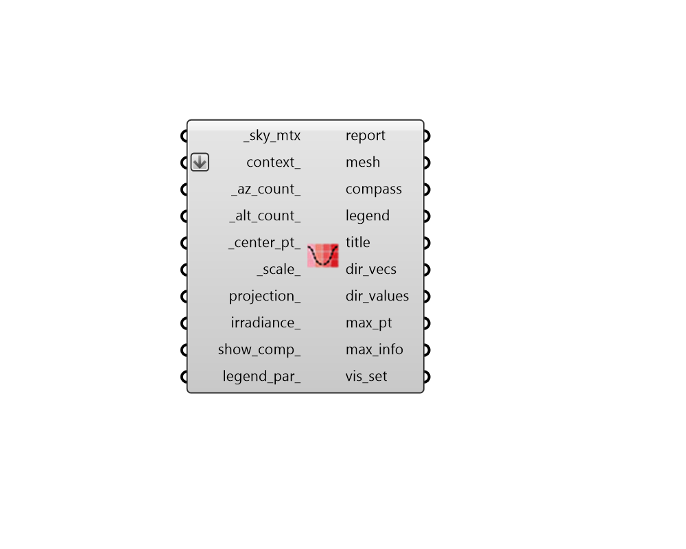

## Radiation Dome

 - [[source code]](https://github.com/ladybug-tools/ladybug-grasshopper/blob/master/ladybug_grasshopper/src//LB%20Radiation%20Dome.py)

Visualize the radiation falling on an object from different directions over a dome. 

The Radiation Dome depicts the amount of solar energy received by all directions over a dome. This is useful for understanding the optimal orientation of solar panels and how the performance of the panel might change if it's orientation is off from the optimal position. It can also be used to identify the optimal wall orientation for passive solar heating when used with skies of radiation harm/benefit. When used with clear sky matrices, it can identify the orientations that result in the highest and lowest peak cooling load. 

The Radiation Dome can be understood in different ways: 1) It's a 3D representation of the "LB Radiation Rose," depicting all tilt angles     for that rose at once. 2) It's the reciprocal of the "LB Sky Dome," since it shows how the radiation from     that sky falls onto a hemispherical object. 3) It's an radiation study of a hemisphere. The results here are effectively the     same as running a hemisphere through the "LB Incident Radiation" component. 

#### Inputs
* ##### sky_mtx [Required]
A Sky Matrix from the "LB Cumulative Sky Matrix" component or the "LB Benefit Sky Matrix" component, which describes the radiation coming from the various patches of the sky. 
* ##### context 
Rhino Breps and/or Rhino Meshes representing context geometry that can block solar radiation to the center of the radiation dome. 
* ##### az_count 
An integer greater than or equal to 3, which notes the number of horizontal orientations to be evaluated on the dome. (Default: 72). 
* ##### alt_count 
An integer greater than or equal to 3, which notes the number of vertical orientations to be evaluated on the dome. (Default: 18). 
* ##### center_pt 
A point for the center of the radiation dome. (Default: (0, 0, 0)) 
* ##### scale 
A number to set the scale of the Radiation Dome. The default is 1, which corresponds to a radius of 100 meters in the current Rhino model's unit system. 
* ##### projection 
Optional text for the name of a projection to use from the sky dome hemisphere to the 2D plane. If None, a 3D sky dome will be drawn instead of a 2D one. (Default: None) Choose from the following: 

    * Orthographic

    * Stereographic
* ##### irradiance 
Boolean to note whether the radiation dome should be plotted with units of cumulative Radiation (kWh/m2) [False] or with units of average Irradiance (W/m2) [True]. (Default: False). 
* ##### show_comp 
Boolean to indicate whether only one dome with total radiation should be displayed (False) or three domes with the solar radiation components (total, direct, and diffuse) should be shown. (Default: False). 
* ##### legend_par 
An optional LegendParameter object to change the display of the radiation dome (Default: None). 

#### Outputs
* ##### report
... 
* ##### mesh
A colored mesh of a dome, representing the intensity of radiation/irradiance from different cardinal directions. 
* ##### compass
A set of circles, lines and text objects that mark the cardinal directions in relation to the radiation dome. 
* ##### legend
A legend showing the kWh/m2 or W/m2 values that correspond to the colors of the mesh. 
* ##### title
A text object for the title of the radiation dome. 
* ##### dir_vecs
A list of vectors for each of the directions the dome is facing. All vectors are unit vectors. 
* ##### dir_values
Radiation values for each of the dome directions in kWh/m2 or W/m2. This will be one list if show_comp_ is "False" and a list of 3 lists (aka. a Data Tree) for total, direct, diffuse if show_comp_ is "True". 
* ##### max_pt
A point on the radiation dome with the greatest amount of solar radiation/irradiance. For a radiation benefit sky, this is the orientation with the greatest benefit. This can be used to understand the optimalorientation of solar panels or the best direction to face for passive solar heating. 
* ##### max_info
Information about the direction with the greates amount of radiation. This includes the altitude, azimuth, and radiation/irradiance value. 
* ##### vis_set
An object containing VisualizationSet arguments for drawing a detailed version of the Radiation Dome in the Rhino scene. This can be connected to the "LB Preview Visualization Set" component to display this version of the Radiation Dome in Rhino. 