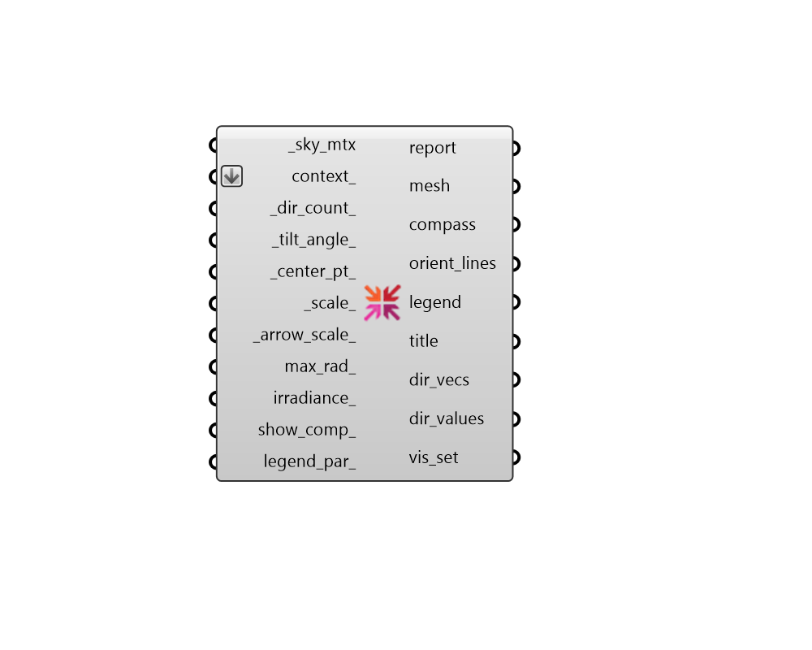

## Radiation Rose

 - [[source code]](https://github.com/ladybug-tools/ladybug-grasshopper/blob/master/ladybug_grasshopper/src//LB%20Radiation%20Rose.py)

Visualize the solar energy falling on different direction as a rose. 

By default, the Radiation Rose depicts the amount of solar energy received by a vertical wall facing each of the directions of the compass rose. 

This is useful for understanding the radiation harm/benefit experienced by different building orientations or the orientations with the highest peak cooling load (for sky matrices of clear skies). The tilt_angle can be used to assess the solar energy falling on geometries that are not perfectly vertical, such as tilted photovoltaic panels. 

#### Inputs
* ##### sky_mtx [Required]
A Sky Matrix from the "LB Cumulative Sky Matrix" component or the "LB Benefit Sky Matrix" component, which describes the radiation coming from the various patches of the sky. 
* ##### context 
Rhino Breps and/or Rhino Meshes representing context geometry that can block solar radiation to the center of the radiation rose. 
* ##### dir_count 
An integer greater than or equal to 3, which notes the number of arrows to be generated for the radiation rose. (Default: 36). 
* ##### tilt_angle 
A number between 0 and 90 that sets the vertical tilt angle (aka. the altitude) for all of the directions. By default, the Radiation Rose depicts the amount of solar energy received by a vertical wall (tilt_angle=0). The tilt_angle can be changed to a specific value to assess the solar energy falling on geometries that are not perfectly vertical, such as a tilted photovoltaic panel. (Default: 0). 
* ##### center_pt 
A point for the center of the radiation rose. (Default: (0, 0, 0)) 
* ##### scale 
A number to set the scale of the Radiation Rose. The default is 1, which corresponds to a radius of 100 meters in the current Rhino model's unit system. 
* ##### arrow_scale 
A fractional number to note the scale of the radiation rose arrows in relation to the entire graphic. (Default: 1). 
* ##### max_rad 
An optional number to set the level of radiation or irradiance associated with the full radius of the rose. If unspecified, this is determined by the maximum level of radiation in the input data but a number can be specified here to fix this at a specific value. This is particularly useful when comparing different roses to one another. 
* ##### irradiance 
Boolean to note whether the radiation rose should be plotted with units of cumulative Radiation (kWh/m2) [False] or with units of average Irradiance (W/m2) [True]. (Default: False). 
* ##### show_comp 
Boolean to indicate whether only one rose with total radiation should be displayed (False) or three roses with the solar radiation components (total, direct, and diffuse) should be shown. (Default: False). 
* ##### legend_par 
An optional LegendParameter object to change the display of the Radiation Rose. 

#### Outputs
* ##### report
... 
* ##### mesh
A colored mesh of arrows, representing the intensity of radiation from different cardinal directions. 
* ##### compass
A set of circles, lines and text objects that mark the cardinal directions in relation to the radiation rose. 
* ##### orient_lines
A list of line segments marking the orientation of each arrow. 
* ##### legend
A legend showing the kWh/m2 or W/m2 values that correspond to the colors of the mesh. 
* ##### title
A text object for the title of the radiation rose. 
* ##### dir_vecs
A list of vectors for each of the directions the rose is facing. All vectors are unit vectors. 
* ##### dir_values
Radiation values for each of the rose directions in kWh/m2 or W/m2. This will be one list if show_comp_ is "False" and a list of 3 lists (aka. a Data Tree) for total, direct, diffuse if show_comp_ is "True". 
* ##### vis_set
Script variable RadRose 