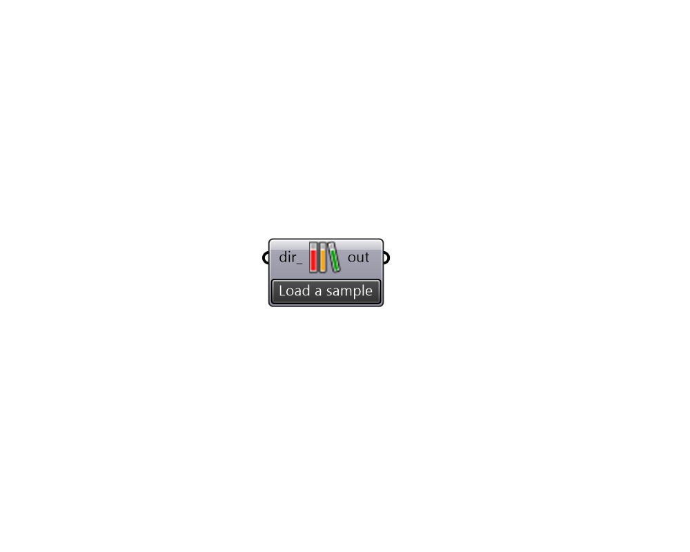

## Samples

 - [[source code]](https://github.com/ladybug-tools/ladybug-grasshopper/blob/master/ladybug_grasshopper/src//LB%20Samples.py)

Load sample files 

#### Inputs
* ##### dir 
Alternative folder path to load the sample files. 

#### Outputs
* ##### out
Sample files found from folders 