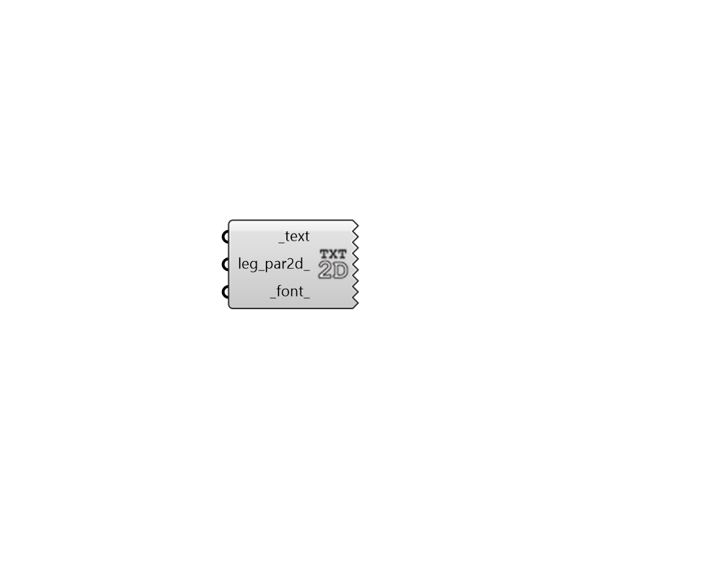

## Screen Oriented Text

 - [[source code]](https://github.com/ladybug-tools/ladybug-grasshopper/blob/master/ladybug_grasshopper/src//LB%20Screen%20Oriented%20Text.py)

Generate screen-oriented text that displays in the Rhino scene as a head-up display (HUD). 

This is useful when there are certain summary results or information that should always be displayed on-screen. 

#### Inputs
* ##### text [Required]
Text string to be displayed in the plane of the screen. 
* ##### leg_par2d 
Optional 2D LegendParameters from the "LB Legend Parameters 2D" component, which will be used to customize a text in the plane of the screen. Note that only the text_height, origin_x and origin_y inputs of this component affect the placement of the text. 
* ##### font 
An optional text string to specify the font to be used for the text. Examples include "Arial", "Times New Roman", "Courier" (all without quotations). Default is "Arial". 

#### Outputs