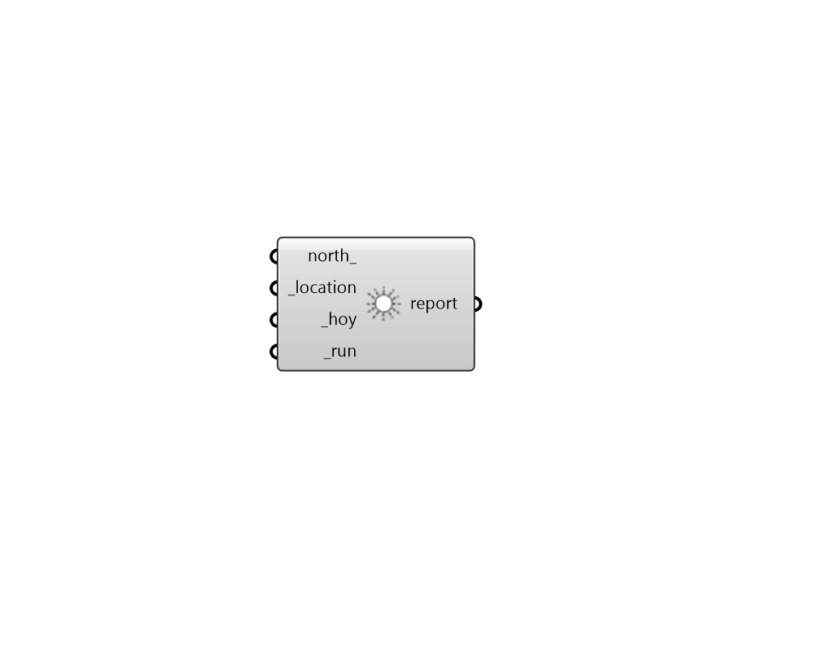

## Set Rhino Sun

 - [[source code]](https://github.com/ladybug-tools/ladybug-grasshopper/blob/master/ladybug_grasshopper/src//LB%20Set%20Rhino%20Sun.py)

Set the sun in the Rhino scene to correspond to a given location and date/time. 

This can be help coordinate Rhino visualizations with Ladybug analyses. 

#### Inputs
* ##### north 
A number between -360 and 360 for the counterclockwise difference between the North and the positive Y-axis in degrees. 90 is West and 270 is East. This can also be Vector for the direction to North. (Default: 0) 
* ##### location [Required]
A ladybug Location that has been output from the "LB Import EPW" component or the "LB Construct Location" component. 
* ##### hoy [Required]
Script variable rhinoSun 
* ##### run [Required]
Set to True to run the component set the Rhino Sun. 

#### Outputs
* ##### report
Reports, errors, warnings, etc. 