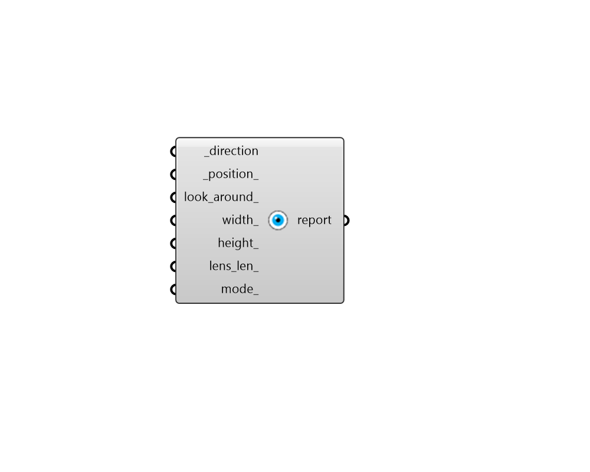

## Set View

 - [[source code]](https://github.com/ladybug-tools/ladybug-grasshopper/blob/master/ladybug_grasshopper/src//LB%20Set%20View.py)

Open a new viewport in Rhino that shows the parallel-projected view from the sun. 

This is useful for understanding what parts of Rhino geometry are shaded at a particular hour of the day. 

#### Inputs
* ##### direction [Required]
A vector for the direction that the viewport camera faces. 
* ##### position 
A point for the position of the vieport camera in 3D space. If no point is provided, the Rhino origin will be used (0, 0, 0). 
* ##### look_around 
Optional 2D point (aka. UV coordinates) to tilt the viewport camera off from from the input _direction. Values for UV coordinates must be between 0 and 1 and these correspond to a tilt of 90 degrees in either direction (with 0.5, 0.5 being centered on the _direction). Inputting a native Grasshopper Slider MD component will allow the most control of view offsetting. 
* ##### width 
An optional interger for the width (in pixels) of the Rhino viewport that will be generated. 
* ##### height 
An optional interger for the height (in pixels) of the Rhino viewport that will be generated. 
* ##### lens_len 
An optional number that sets the lens length of the viewport camera in mm. Typical values are around 20-50mm but wider angle views can be achieved by lowering this number to 10 or less. If unspecified, the lens length of the currently active Rhino viewport will be used. 
* ##### mode 
An optional text input for the display mode of the Rhino viewport that will be generated. For example: Wireframe, Shaded, Rendered, etc. If unspecified, the mode of the currenlty active Rhino viewport will be used 

#### Outputs
* ##### report
The name of the viewport that was opened. 