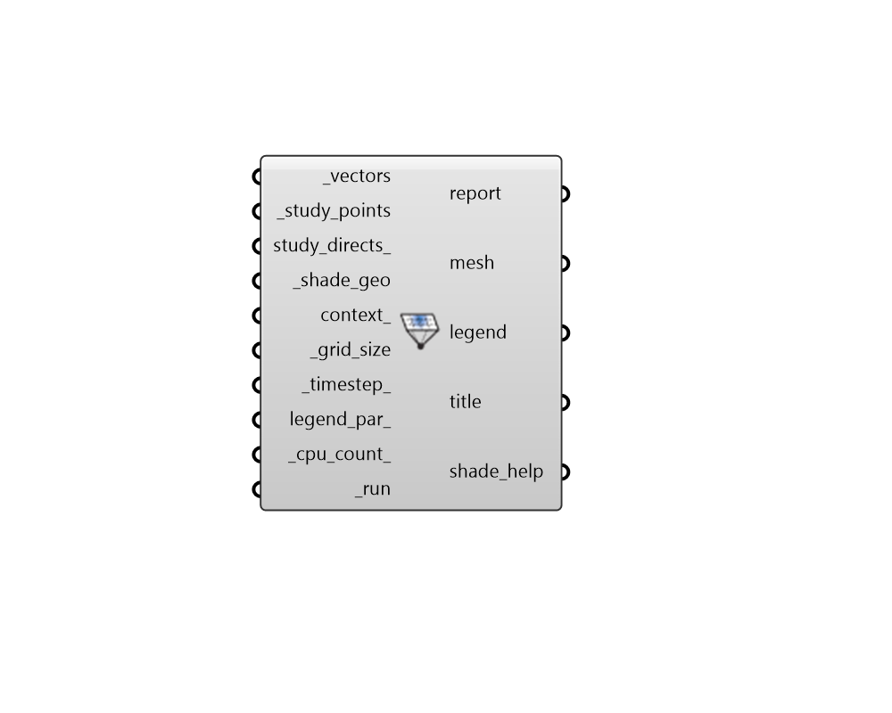

## Shade Benefit

 - [[source code]](https://github.com/ladybug-tools/ladybug-grasshopper/blob/master/ladybug_grasshopper/src//LB%20Shade%20Benefit.py)

Visualize the desirability of shade in terms of the time period of blocked sun vectors for each part of a shade geometry. 

The calculation assumes that all input _vectors represent sun to be blocked, which is often the case when evaluating shade in terms of its benefit for glare reduction and occupant visual comfort. It can also be the case when sun vectors have been filtered to account for times of peak cooling demand or for the heat stress of human subjects. 

The component outputs a colored mesh of the shade illustrating the helpfulness of shading each part of the _shade_geo. A higher saturation of blue indicates that shading the cell blocks more hours of sun and is therefore more desirable. 

The units for shade desirability are hrs/square Rhino unit, which note the amount of time that sun is blocked by a given cell. So, if a given square meter of input _shade_geo has a shade desirability of 10 hrs/m2, this means that a shade in this location blocks an average of 10 hours to each of the _study_points. 

#### Inputs
* ##### vectors [Required]
Sun vectors from the "LB SunPath" component, which will be used to determine the number of hours of sun blocked by the _shade_geo. When evaluating shade benefit in terms of glare reduction, these vectors are typically for any sun-up hour of the year since looking into the sun at practically any hour is likely to induce glare. When using this component to approximate reductions to cooling demand or human heat stress, it's more appropriate to filter sun vectors using a conditional statement or use other types of shade benefit analysis like the "LB Thermal Shade Benefit" component or the "HB Energy Shade Benefit" component. 
* ##### study_points [Required]
Points representing an location in space for which shading desirability is being evaluated. For a study of shade desirability for reducing glare, this is often the location of the human subject's view. For a study of shade desirability over a surface like a desk or a window, the "LB Generate Point Grid" component can be used to create a set of points over the surface to input here. 
* ##### study_directs 
Optional Vectors that align with the _study_points and represent the direction in which shade desirability is being evaluated. For a study of shade desirability for reducing glare, this is the direction in which human subject is looking. For a study of shade desirability over a surface like a desk or a window, the vectors output of the "LB Generate Point Grid" component should be input here. If not supplied, sun vectors coming from any direction will be used to evualuate shade desirability. 
* ##### shade_geo [Required]
Rhino Breps and/or Rhino Meshes representing shading to be evaluated in terms of its benefit. Note that, in the case that multiple shading geometries are connected, this component does not account for the interaction between the different shading surfaces and will just evaluate each part of the shade independently. 
* ##### context 
Rhino Breps and/or Rhino Meshes representing context geometry that can block sunlight to the _study_points, therefore discounting any benefit or harm that could come to the region. 
* ##### grid_size [Required]
A positive number in Rhino model units for the size of grid cells at which the input _shade_geo will be subdivided for shade benefit analysis. The smaller the grid size, the higher the resolution of the analysis and the longer the calculation will take.  So it is recommended that one start with a large value here and decrease the value as needed. However, the grid size should usually be smaller than the dimensions of the smallest piece of the _shade_geo and context_ in order to yield meaningful results. 
* ##### timestep 
A positive integer for the number of timesteps per hour at which the "LB SunPath" component generated sun vectors. This is used to correctly interpret the time duration represented by each of the input sun vectors. (Default: 1 for 1 vector per hour). 
* ##### legend_par 
Optional legend parameters from the "LB Legend Parameters" that will be used to customize the display of the results. 
* ##### cpu_count 
An integer to set the number of CPUs used in the execution of the intersection calculation. If unspecified, it will automatically default to one less than the number of CPUs currently available on the machine or 1 if only one processor is available. 
* ##### run [Required]
Set to "True" to run the component and perform shade benefit analysis. 

#### Outputs
* ##### report
... 
* ##### mesh
A colored mesh of the _shade_geo showing where shading is helpful (in blue), and where it does not make much of a difference (white or desaturated colors). Note that the colors can change depending upon the input legend_par_. 
* ##### legend
Legend showing the numeric values of hrs / square unit that correspond to the colors in the shade mesh. 
* ##### title
A text object for the study title. 
* ##### shade_help
The cumulative hrs / square unit helped by shading the given cell. If a given square meter of _shade_geo has a shade helpfulness of 10 hrs/m2, this means that a shade in this location blocks an average of 10 hours to each of the _study_points. 