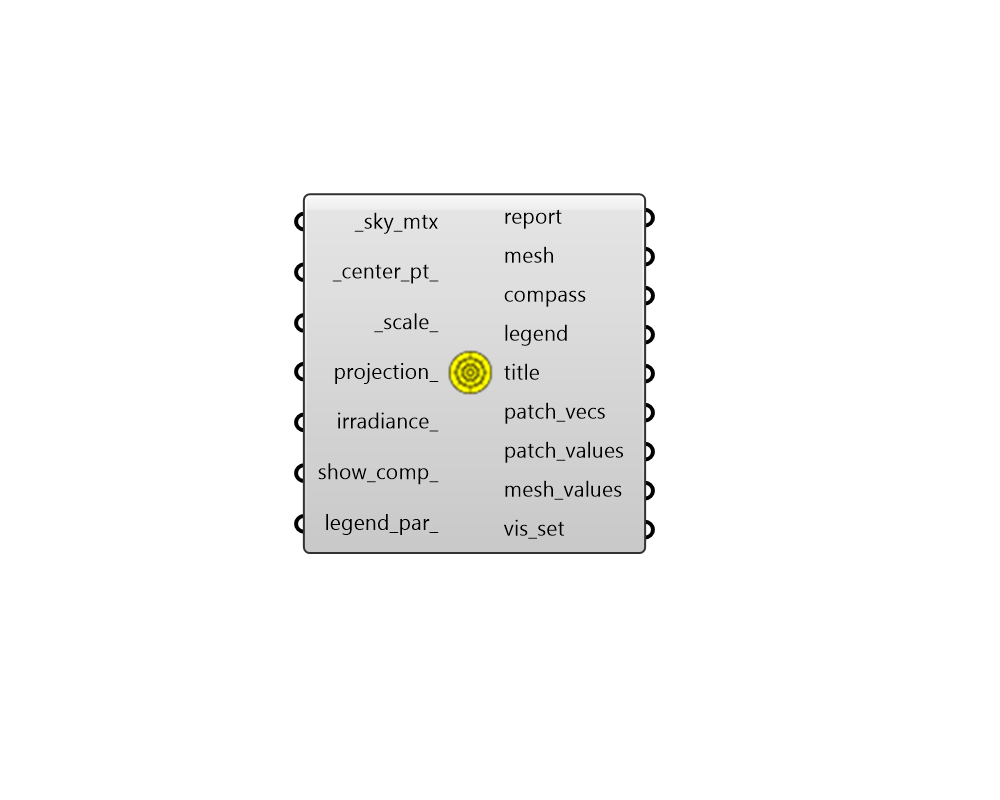

## Sky Dome

 - [[source code]](https://github.com/ladybug-tools/ladybug-grasshopper/blob/master/ladybug_grasshopper/src//LB%20Sky%20Dome.py)

Visualize a sky matrix from the "LB Cumulative Sky Matrix" component as a colored dome, subdivided into patches with a radiation value for each patch. 

#### Inputs
* ##### sky_mtx [Required]
A Sky Matrix from the "LB Cumulative Sky Matrix" component or the "LB Benefit Sky Matrix" component, which describes the radiation coming from the various patches of the sky. 
* ##### center_pt 
A point for the center of the dome. (Default: (0, 0, 0)) 
* ##### scale 
A number to set the scale of the sky dome. The default is 1, which corresponds to a radius of 100 meters in the current Rhino model's unit system. 
* ##### projection 
Optional text for the name of a projection to use from the sky dome hemisphere to the 2D plane. If None, a 3D sky dome will be drawn instead of a 2D one. (Default: None) Choose from the following: 

    * Orthographic

    * Stereographic
* ##### irradiance 
Boolean to note whether the sky dome should be plotted with units of cumulative Radiation (kWh/m2) [False] or with units of average Irradiance (W/m2) [True]. (Default: False). 
* ##### show_comp 
Boolean to indicate whether only one dome with total radiation should be displayed (False) or three domes with the solar radiation components (total, direct, and diffuse) should be shown. (Default: False). 
* ##### legend_par 
An optional LegendParameter object to change the display of the sky dome (Default: None). 

#### Outputs
* ##### report
... 
* ##### mesh
A colored mesh representing the intensity of radiation for each of the sky patches within the sky dome. 
* ##### compass
A set of circles, lines and text objects that mark the cardinal directions in relation to the sky dome. 
* ##### legend
A legend showing the kWh/m2 or W/m2 values that correspond to the colors of the mesh. 
* ##### title
A text object for the title of the sky dome. 
* ##### patch_vecs
A list of vectors for each of the patches of the sky dome. All vectors are unit vectors and point from the center towards each of the patches. They can be used to construct visualizations of the rays used to perform radiation analysis. 
* ##### patch_values
Radiation values for each of the sky patches in kWh/m2 or W/m2. This will be one list if show_comp_ is "False" and a list of 3 lists (aka. a Data Tree) for total, direct, diffuse if show_comp_ is "True". 
* ##### mesh_values
Radiation values for each face of the dome mesh in kWh/m2. This can be used to post-process the radiation data and then regenerate the dome visualization using the mesh output from this component and the "LB Spatial Heatmap" component. Examples of useful post- processing include converting the units to something other than kWh/m2, inverting the +/- sign of radiation values depending on whether radiation is helpful or harmful to building thermal loads, etc. This will be one list if show_comp_ is "False" and a list of 3 lists (aka. a Data Tree) for total, direct, diffuse if show_comp_ is "True". 
* ##### vis_set
An object containing VisualizationSet arguments for drawing a detailed version of the Sky Dome in the Rhino scene. This can be connected to the "LB Preview Visualization Set" component to display this version of the Sky Dome in Rhino. 