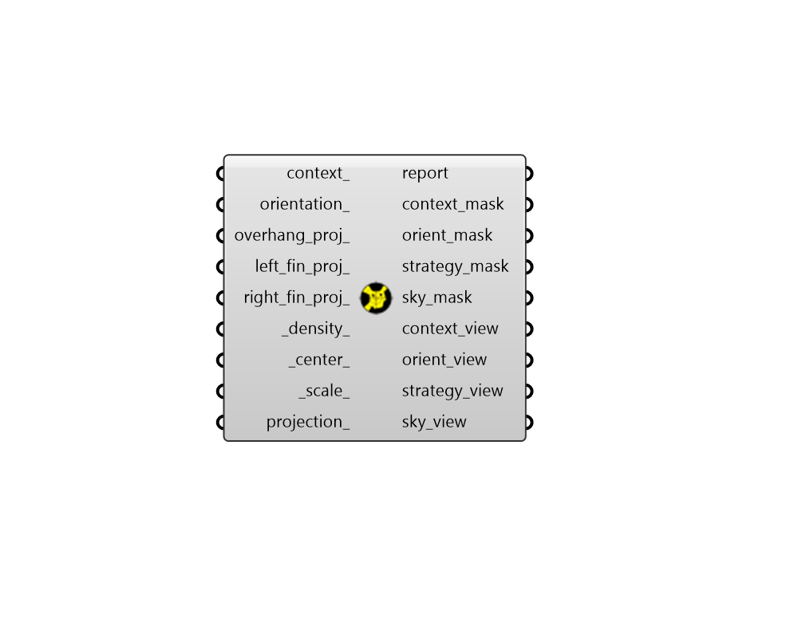

## Sky Mask
 - [[source code]](https://github.com/ladybug-tools/ladybug-grasshopper/blob/master/ladybug_grasshopper/src//LB%20Sky%20Mask.py)

Visualize the portion of the sky dome that is masked by context geometry or shading
 strategies around a given point.
 

Separate meshs will be generated for the portions of the sky dome that are masked
 vs visible. The percentage of the sky that is masked by the context geometry and
 is visible will also be computed.
 

#### Inputs
* ##### context 
Rhino Breps and/or Rhino Meshes representing context geometry that can block the sky to the center of the sky mask. 
* ##### orientation 
A number between 0 and 360 that sets the direction of a vertically- oriented surface for which the sky view will be visualized and computed. Alternatively, this input can be the words "north", "east", "south" or "west." An input here will result in the output of an orient_mask, which blocks the portion of the sky that is not visible from a vertical surface with this orientation. Furthermore, all of the view-related outputs will be computed for a surface with the specified orientation (overriding any plane input for the _center_). 
* ##### overhang_proj 
A number between 0 and 90 that sets the angle between the _center_ and the edge of an imagined horizontal overhang projecting past the point. Note that this option is only available when there is an input for orientation_ above. An input here will result in the output of a strategy_mask, which blocks the portion of the sky taken up by an overhang with the input projection angle. 
* ##### left_fin_proj 
A number between 0 and 180 that sets the angle between the _center_ and the edge of an imagined vertical fin projecting past the left side of the point. Note that this option is only available when there is an input for orientation_ above. An input here will result in the output of a strategy_mask, which blocks the portion of the sky taken up by a vertical fin with the input projection angle. 
* ##### right_fin_proj 
A number between 0 and 180 that sets the angle between the _center_ and the edge of an imagined vertical fin projecting past the right side of the point. Note that this option is only available when there is an input for orientation_ above. An input here will result in the output of a strategy_mask, which blocks the portion of the sky taken up by a vertical fin with the input projection angle. 
* ##### density 
An integer that is greater than or equal to 1, which to sets the number of times that the sky patches are split. Higher numbers input here will ensure a greater accuracy but will also take longer to run. A value of 3 should result in sky view factors with less than 1% error from the true value. (Default: 1). 
* ##### center 
A point or plane for which the visible portion of the sky will be evaluated. If a point is input here, the view-related outputs will be indiferent to orientation and the sky_view outut will technically be Sky Exposure (or the fraction of the sky hemisphere that is visible from the point). If a plane is input here (or an orientation_ is connected), the view-related outputs will be sensitive to orientation and the sky_view output will be true Sky View (or the fraction of the sky visible from a surface in a plane). If no value is input here, the center will be a point (Sky Exposure) at the Rhino origin (0, 0, 0). 
* ##### scale 
A number to set the scale of the sky mask. The default is 1, which corresponds to a radius of 100 meters in the current Rhino model's unit system. 
* ##### projection 
Optional text for the name of a projection to use from the sky dome hemisphere to the 2D plane. If None, a 3D dome will be drawn instead of a 2D one. Choose from the following: 

    * Orthographic

    * Stereographic

#### Outputs
* ##### report
... 
* ##### context_mask
A mesh for the portion of the sky dome masked by the context_ geometry. 
* ##### orient_mask
A mesh for the portion of the sky dome that is not visible from a surface is facing a given orientation. 
* ##### strategy_mask
A mesh of the portion of the sky dome masked by the overhang, left fin, and right fin projections. 
* ##### sky_mask
A mesh of the portion of the sky dome visible by the _center_ through the strategies and context_ geometry. 
* ##### context_view
The percentage of the sky dome masked by the context_ geometry. 
* ##### orient_view
The percentage of the sky dome that is not visible from a surface is facing a given orientation. 
* ##### strategy_view
The percentage of the sky dome viewed by the overhang, left fin, and right fin projections. 
* ##### sky_view
The percentage of the sky dome visible by the _center_ through the strategies and context_ geometry. 