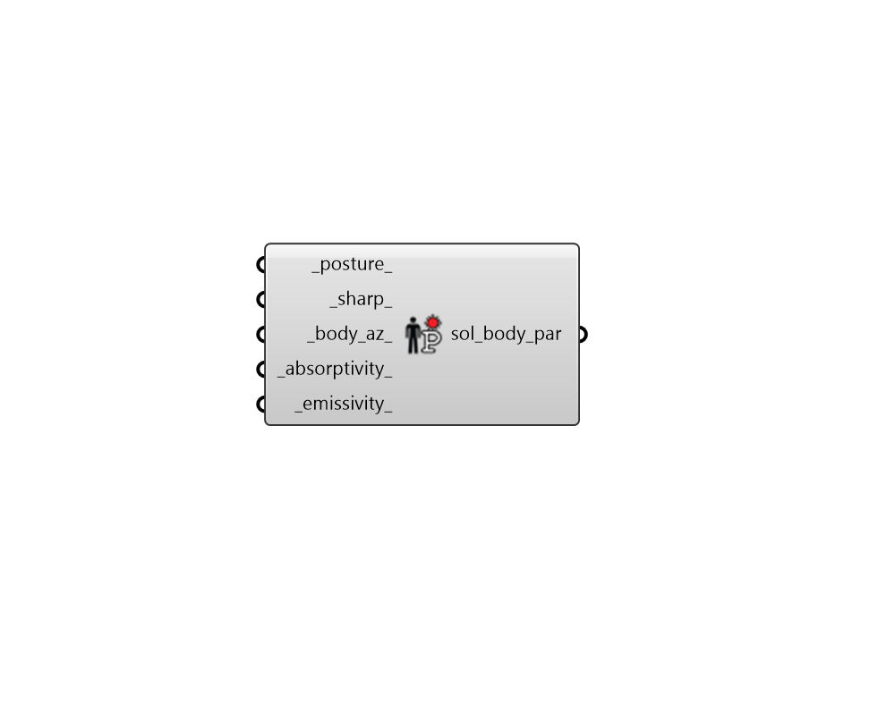

##  Solar Body Parameters - [[source code]](https://github.com/ladybug-tools/ladybug-grasshopper/blob/master/ladybug_grasshopper/src//LB%20Solar%20Body%20Parameters.py)

Create a set of parameters that define the characteristics of a human
 in relation to the sun that falls on them.
 

These parameters can be plugged into any of the components that estimate
 mean radiant temperature (MRT) deltas as a result of being in the sun.
 

#### Inputs
* ##### posture 
A text string indicating the posture of the body. Letters must
 be lowercase.  Choose from the following:
     - standing
    - seated
    - supine
Default is "standing". 
* ##### sharp 
A number between 0 and 180 representing the solar horizontal
 angle relative to front of person (SHARP). 0 signifies sun that is
 shining directly into the person's face and 180 signifies sun that
 is shining at the person's back. Default is 135, asuming that a person
 typically faces their side or back to the sun to avoid glare. 
* ##### body_az 
A number between 0 and 360 representing the direction that
 the human is facing in degrees (0=North, 90=East, 180=South, 270=West).
 Default is None, which will assume that the sharp input dictates the
 degrees the human is facing from the sun. 
* ##### absorptivity 
A number between 0 and 1 representing the average
 shortwave absorptivity of the body (including clothing and skin color).
 Typical clothing values - white: 0.2, khaki: 0.57, black: 0.88
 Typical skin values - white: 0.57, brown: 0.65, black: 0.84
 Default is 0.7 for average (brown) skin and medium clothing. 
* ##### emissivity 
A number between 0 and 1 representing the average
 longwave emissivity of the body.  Default is 0.95, which is almost
 always the case except in rare situations of wearing metalic clothing. 

#### Outputs
* ##### sol_body_par
A solar body parameter object that can be plugged into
 any of the components that estimate mean radiant temperature (MRT)
 deltas as a result of being in the sun.