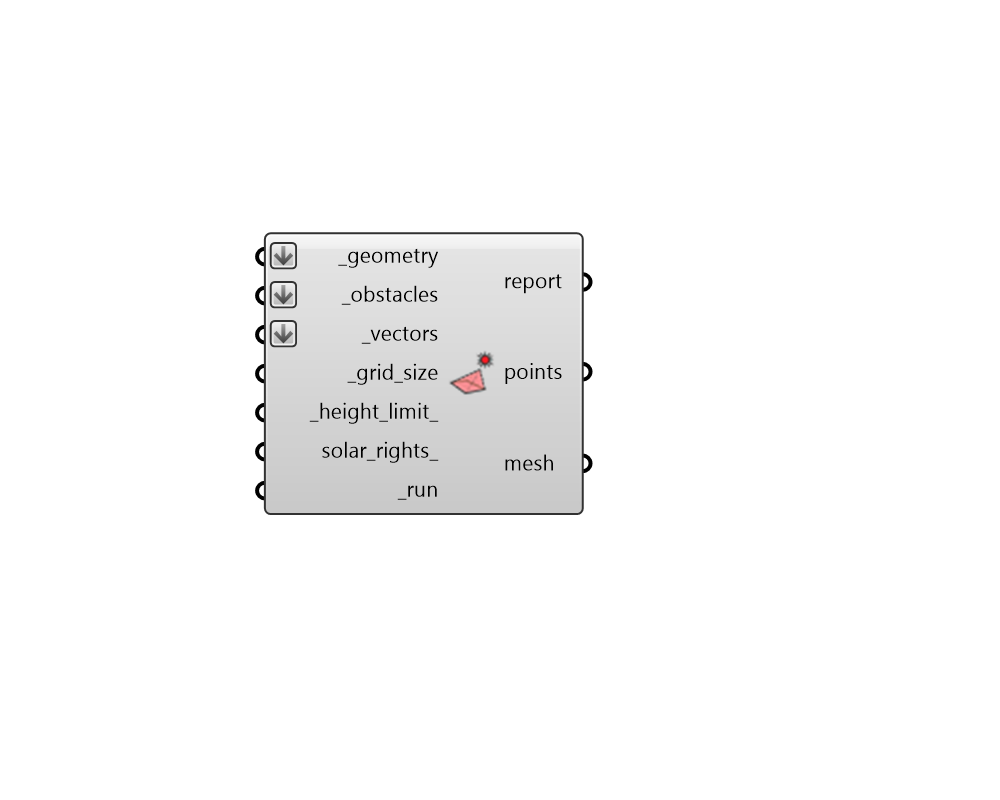

## Solar Envelope
 - [[source code]](https://github.com/ladybug-tools/ladybug-grasshopper/blob/master/ladybug_grasshopper/src//LB%20Solar%20Envelope.py)

Generate a solar envelope boundary for a given geometry, set of sun vectors, and
 context (obstacle) geometry.
 

Solar collection envelopes show the height above which one will have solar access
 to certain sun positions on a given site.
 

Solar rights envelopes illustrate the volume in which one can build while ensuring
 that a new development does not shade the surrounding properties for certain sun
 positions.
 

#### Inputs
* ##### geometry [Required]
Rhino Breps and/or Rhino Meshes for which the solar envelope will be computed. If Breps are input, they will be subdivided using the _grid_size to yeild individual points at which analysis will occur. If a Mesh is input, the analysis will be performed for each vertex of the mesh instead of subdividing it. 
* ##### obstacles [Required]
A list of horizontal planar Breps or curves indicating the tops (in the case of solar collection) or bottoms (in the case of solar rights) of context geometries. Being above a solar collection boundary ensures these top surfaces don't block the sun vectors to ones position. Being below a solar rights boundary ensures these bottom surfaces are protected from shade. 
* ##### vectors [Required]
Sun vectors from the "LB SunPath" component, which determine the times of the year when sun should be accessible. 
* ##### grid_size [Required]
A positive number in Rhino model units for the size of grid cells at which the input _geometry will be subdivided for envelope analysis. The smaller the grid size, the higher the resolution of the analysis and the longer the calculation will take.  So it is recommended that one start with a large value here and decrease the value as needed. The default will be a relativel coarse auto-calculated from the bounding box around the _geometry. 
* ##### height_limit 
A positive number for the minimum distance below (for collections) or maximum distance above (for rights) the average _geometry height that the envelope points can be. This is used when there are no vectors blocked for a given point. (Default: 100 meters). 
* ##### solar_rights 
Set to True to compute a solar rights boundary and False to compute a solar collection boundary. Solar rights boundaries represent the boundary below which one can build without shading the surrounding obstacles from any of the _vectors. Solar collection boundaries represent the boundary above which the one will have direct solar access to all of the input _vectors. (Default: False). 
* ##### run [Required]
Set to "True" to run the component and get a solar envelope. 

#### Outputs
* ##### report
... 
* ##### points
The grid of points above the test _geometry representing the height to which the solar envelope boundary reaches. 
* ##### mesh
A mesh representing the solar envelope. For solar collections (the default), this represents the boundary above which the one will have direct solar access to all of the input _vectors. For solar rights envelopes, this represents the boundary below which one can build without shading the surrounding obstacles from any of the _vectors. 