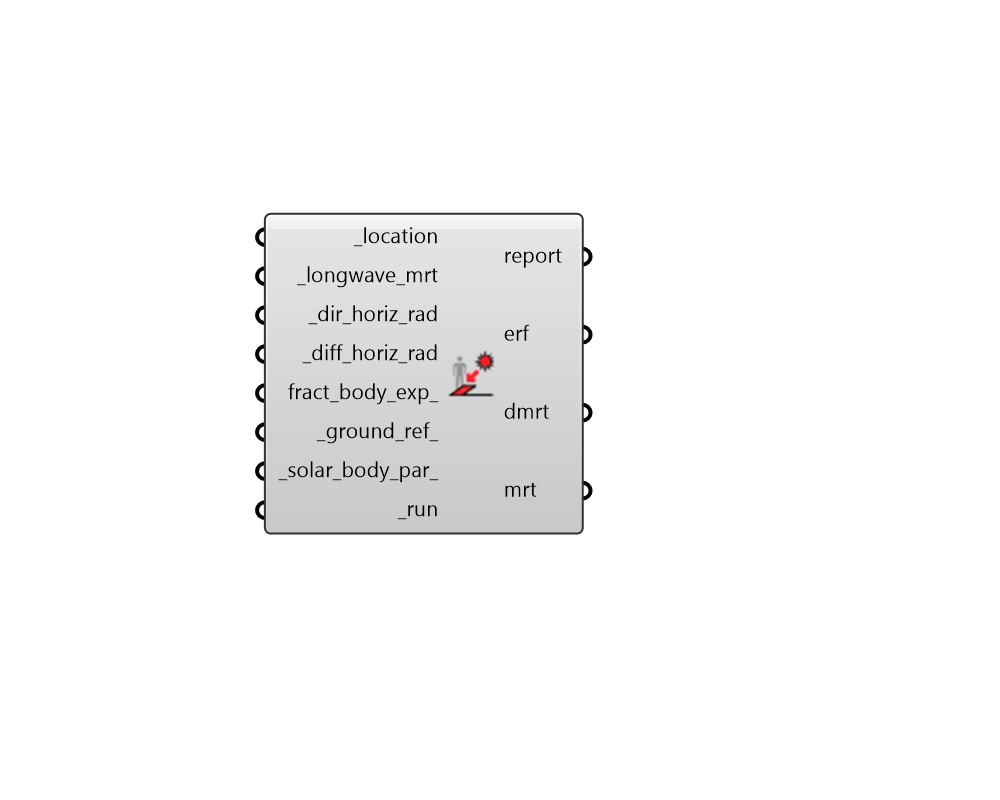

##  Solar MRT from Solar Components - [[source code]](https://github.com/ladybug-tools/ladybug-grasshopper/blob/master/ladybug_grasshopper/src//LB%20Solar%20MRT%20from%20Solar%20Components.py)

Calculate Mean Radiant Temperature (MRT) as a result of shortwave solar using
 horizontal solar components (direct horizontal and diffuse horizontal solar).
 

This component uses the SolarCal model of ASHRAE-55 to estimate the effects
 of shortwave solar and a simple sky exposure method to determine longwave
 radiant exchange.
 

#### Inputs
* ##### location [Required]
A Ladybug Location object. 
* ##### longwave_mrt [Required]
A single number or an hourly data collection with the long-wave
 mean radiant temperature around the person in degrees C.
 This includes the temperature of the ground and any other
 surfaces between the person and their view to the sky.
 Typically, air temperature is used when such surface
 temperatures are unknown. 
* ##### dir_horiz_rad [Required]
Hourly Data Collection with the direct horizontal solar
 irradiance in W/m2. 
* ##### diff_horiz_rad [Required]
Hourly Data Collection with diffuse horizontal solar
 irradiance in W/m2. 
* ##### fract_body_exp 
A single number between 0 and 1 or a data collection
 representing the fraction of the body exposed to direct sunlight.
 Note that this does not include the body’s self-shading; only the
 shading from surroundings.
 Default is 1 for a person standing in an open area. 
* ##### ground_ref 
A single number between 0 and 1 or a data collection
 that represents the reflectance of the floor. Default is for 0.25
 which is characteristic of outdoor grass or dry bare soil. 
* ##### solar_body_par 
Optional solar body parameters from the "LB Solar Body Parameters"
 object to specify the properties of the human geometry assumed in the
 shortwave MRT calculation. The default assumes average skin/clothing
 absorptivity and a human subject always has their back to the sun
 at a 45-degree angle (SHARP = 135). 
* ##### run [Required]
Set to True to run the component. 

#### Outputs
* ##### report
Reports, errors, warnings, etc.
* ##### erf
Data collection of effective radiant field (ERF) in W/m2.
* ##### dmrt
Data collection of mean radiant temperature delta in C.
* ##### mrt
Data collection of mean radiant temperature in C.