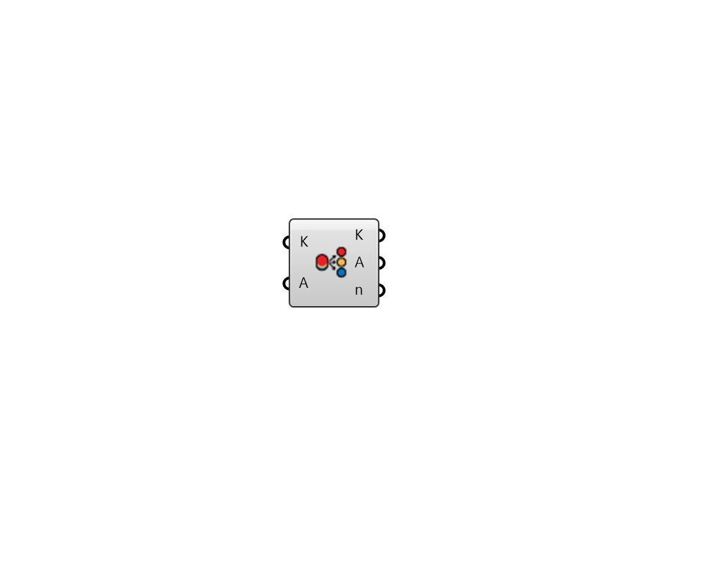

# SortByLayers

 - [\[source code\]](https://github.com/ladybug-tools/ladybug-grasshopper/blob/master/ladybug\_grasshopper/src/LB%20SortByLayers.py)

Sort and group Rhino objects by layers. Please find the source code from: [https://github.com/ladybug-tools/ladybug-grasshopper-dotnet](https://github.com/ladybug-tools/ladybug-grasshopper-dotnet)

## Inputs

*   **K**

    A list of Rhino objects that associated with sortable layers&#x20;
*   **A**

    Optional object list to sort synchronously&#x20;

## Outputs

*   **K**

    Sorted objects by layers&#x20;
*   **A**

    Synchronously sorted objects&#x20;
*   **n**

    Grouped layer names&#x20;
