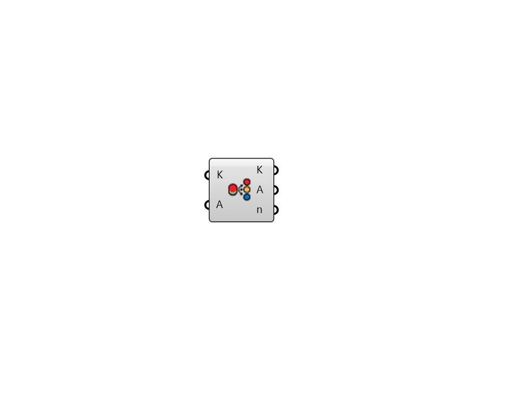

## Sort by Layers

 - [[source code]](https://github.com/ladybug-tools/ladybug-grasshopper/blob/master/ladybug_grasshopper/src//LB%20Sort%20by%20Layers.py)

Sort and group Rhino objects by layers.  Please find the source code from: https://github.com/ladybug-tools/ladybug-grasshopper-dotnet 

#### Inputs
* ##### K 
A list of Rhino objects that associated with sortable layers 
* ##### A 
Optional object list to sort synchronously 

#### Outputs
* ##### K
Sorted objects by layers 
* ##### A
Synchronously sorted objects 
* ##### n
Grouped layer names 