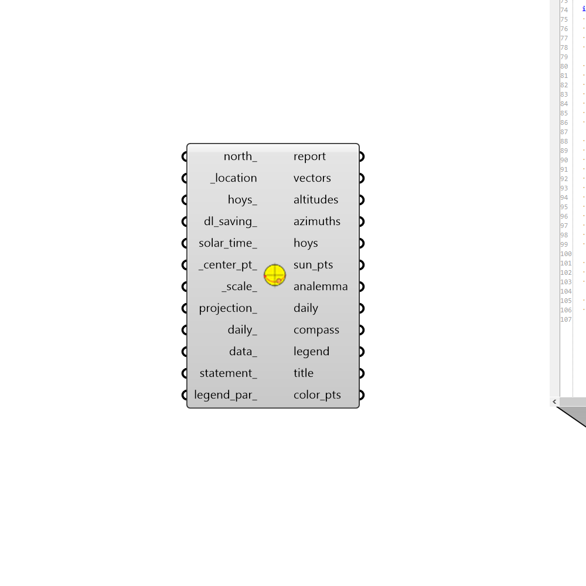

## SunPath

 - [[source code]](https://github.com/ladybug-tools/ladybug-grasshopper/blob/master/ladybug_grasshopper/src//LB%20SunPath.py)

Output a Sunpath (aka. sun plot) graphic into the Rhino scene. 

The component also outputs sun vectors that can be used for solar access analysis and shading design. 

#### Inputs
* ##### north 
A number between -360 and 360 for the counterclockwise difference between the North and the positive Y-axis in degrees. 90 is West and 270 is East. This can also be Vector for the direction to North. (Default: 0) 
* ##### location [Required]
A ladybug Location that has been output from the "LB Import EPW" component or the "LB Construct Location" component. 
* ##### hoys 
A number or list of numbers between 0 and 8760 that represent the hour of the year at which to evaluate the sun position. The "LB Calculate HOY" component can output this number given a month, day and hour. The "LB Analysis Period" component can output a list of HOYs within a certain hour or date range. 
* ##### dl_saving 
An optional analysis period for daylight saving time. If None, no daylight saving time will be used. (Default: None) 
* ##### solar_time 
A boolean to indicate if the input hours should be treated as solar time instead of standard or daylight time. (Default: False) 
* ##### center_pt 
A point for the center of the sun path. (Default: (0, 0, 0)) 
* ##### scale 
A number to set the scale of the sun path. The default is 1, which corresponds to a radius of 100 meters in the current Rhino model's unit system. 
* ##### projection 
Optional text for the name of a projection to use from the sky dome hemisphere to the 2D plane. If None, a 3D sun path will be drawn instead of a 2D one. (Default: None) Choose from the following: 

    * Orthographic

    * Stereographic
* ##### daily 
Boolean to note whether the sunpath should display only one daily arc for each unique day in the input hoys_ (True) or whether the output sun path geometry should be for the entire year, complete with analemmas for all sun-up hours and a daily arc for each month (False). (Default: False) 
* ##### data 
Optional HourlyContinuousCollection objects, which will be used to generate colors that align with each of the sun_pts. This data can also be used along with the statement_ below to select out sun positions that meet certain conditions. 
* ##### statement 
A conditional statement as a string (e.g. a > 25). 
The variable of the first data collection should always be named 'a' (without quotations), the variable of the second list should be named 'b', and so on. 
For example, if three data collections are connected to _data and the following statement is applied: '18 < a < 26 and b < 80 and c > 2' The resulting collections will only include values where the first data collection is between 18 and 26, the second collection is less than 80 and the third collection is greater than 2. 
* ##### legend_par 
An optional LegendParameter object to change the display of the data on the sun path. This can also be a list of legend parameters to be applied to the different connected data_. 

#### Outputs
* ##### report
Reports, errors, warnings, etc. 
* ##### vectors
Vector(s) indicating the direction of sunlight for each sun position on the sun path. Note that these vectors point downwards towards the ground. 
* ##### altitudes
Number(s) indicating the sun altitude(s) in degrees for each sun position on the sun path. 
* ##### azimuths
Number(s) indicating the sun azimuths in degrees for each sun position on the sun path. 
* ##### hoys
The hour of the year for each sun positions on the sun path. 
* ##### sun_pts
Point(s) representing the location of the sun on the sunpath. 
* ##### analemma
A set of curves that mark the hourly positions of the sun throughout the different months of the year. 
* ##### daily
A set of arcs that mark the path of the sun across the sky dome over the course of a day. 
* ##### compass
A set of circles, lines and text objects that mark the cardinal directions in relation to the sun path. 
* ##### legend
Geometry representing the legend for the input data_. Will be None if no _data is connected. 
* ##### title
A text object for the title of the sunpath. 
* ##### color_pts
A list of points colored with the input data_, which will display in the Rhino scene in accordance with the legend. Note that the text representation of these objects bears the RGB color of each point. So casting this output to text and then to a color will yeild color objects that can be used for previewing other types of geometry with the input data_. Will be None if no _data is connected. 