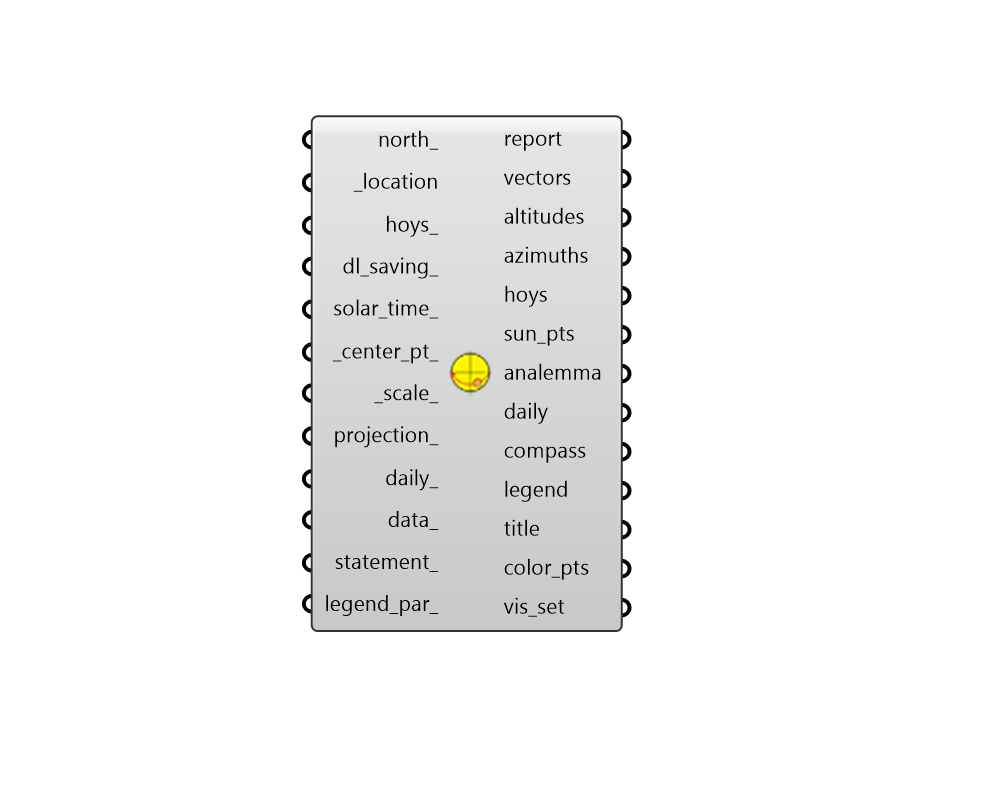

##  SunPath - [[source code]](https://github.com/ladybug-tools/ladybug-grasshopper/tree/master/plugin/grasshopper/src/LadybugPlus_SunPath.py)

Use this component to make a 3D sun-path (aka. sun plot).
 The component also outputs sun vectors that can be used for solar access
 analysis or shading design.
 -

#### Inputs
* ##### north [Optional]
Input a number between 0 and 360.
 It represents the degrees off from the y-axis to make North.
 The default North direction is set to the Y-axis (0 degrees).
* ##### location [Required]
The output from the importEPW or constructLocation component.
 This is essentially a list of text summarizing a location on the
 earth.
* ##### hoys [Default]
A list or a single number that respresent an hour of the year.
 Use Analysis Period or HOY nodes to generate the numbers.
* ##### centerPt [Default]
Input a point here to change the location of the sun path.
 The default is set to the Dynamo model origin (0,0,0).
* ##### scale [Default]
Input a number here to change the scale of the sun path.
 The default is set to 1.
* ##### sunScale [Default]
Input a number here to change the scale of the sun spheres
 located along the sun path.  The default is set to 1.
* ##### annual [Default]
By default, this value is set to "True" (or 1) which
 will produce a sun path for the whole year. Set this input to "False"
 (or 0) to generate a sun path for just one day of the year (or
 several days if multiple days are included in the analysis period).

#### Outputs
* ##### report
...
* ##### vectors
Vector(s) indicating the direction of sunlight for each sun
 position on the sun path.
* ##### altitudes
Number(s) indicating the sun altitude(s) in degrees for
 each sun position on the sun path.
* ##### azimuths
Number(s) indicating the sun azimuths in degrees for each
 sun position on the sun path.
* ##### sunPts
Point(s) idicating the location on the sun path of each
 sun position.
* ##### analemma
A set of curves that mark the path of the sun across the sky
 dome.
* ##### compass
Script variable sunpath
* ##### daily
Script variable sunpath
* ##### centerPt
The center point of the sun path
* ##### hoys
The hour of the year for each sun position on the sun path.
* ##### datetimes
The date and info for each sun position on the sun path.

[Check Hydra Example Files for SunPath](https://hydrashare.github.io/hydra/index.html?keywords=LadybugPlus_SunPath)