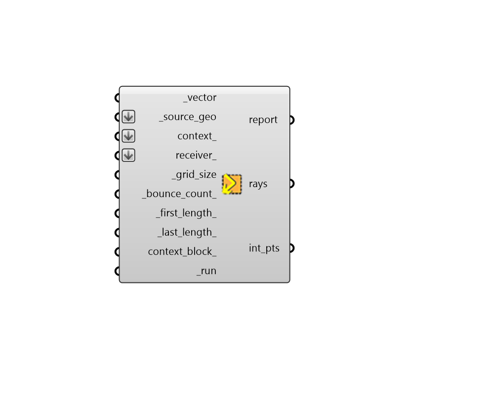

## Surface Ray Tracing

 - [[source code]](https://github.com/ladybug-tools/ladybug-grasshopper/blob/master/ladybug_grasshopper/src//LB%20Surface%20Ray%20Tracing.py)

Get a ray tracing visualization of direct sunlight rays reflected off of _source_geo and subsequently bouncing through a set of context_ geometries. 

Examples where this visualization could be useful include understading the reflection of light by a light shelf or testing to see whether a parabolic glass or metal building geometry might focus sunlight to dangerous levels at certain times of the year. 

Note that this component assumes that all sun light is reflected specularly (like a mirror) and, for more detailed raytracing analysis with diffuse scattering, the Honeybee Radiance components should be used. 

#### Inputs
* ##### vector [Required]
A sun vector (typically from the "LB SunPath" component), which will be used to evaluate the light boucing off of the _source_geo and through the context_. 
* ##### source_geo [Required]
A brep or mesh representing a surface off of which sun rays first bounce. Lists of breps or meshes are also acceptable. These surfaces will be used to generate the initial sun rays in a grid-like pattern. 
* ##### context 
Breps or meshes for conext geometry, which will reflect the sun rays after they bounce off of the _source_geo. They can also block the sun rays to the _source_geo if context_block_ is set to True. 
* ##### receiver 
Optional breps or meshes for receiver geometry for which sun ray intersection is being studied. If specified, only sun rays that reflect off of the _source_geo and have their last bounce intersect this receiver within the _last_length_ distance will appear in the result. This can help filter results to only an area of intersect where the impact of reflected sun rays is a concern. 
* ##### grid_size [Required]
A positive number in Rhino model units for the average distance between sun ray points to generate along the _source_geo. 
* ##### bounce_count 
An positive integer for the number of ray bounces to trace the sun rays forward. (Default: 1). 
* ##### first_length 
A positive number in Rhino model units for the length of the sun ray before the first bounce. If unspecified, this will be the diagonal of the bounding box surrounding all input geometries. 
* ##### last_length 
A positive number in Rhino model units representing the length of the sun ray after the last bounce. If unspecified, this will be the diagonal of the bounding box surrounding all input geometries. 
* ##### context_block 
Set to "True" to count the input _context as something that fully blocks rays as opposed to having the rays simply bounce off of it. This can be particularly useful in cases with lots of rays where you are only concered about the rays that can actually hit the _source_geo. (Default: False). 
* ##### run [Required]
Set to "True" to run the component and perform the ray tracing study. 

#### Outputs
* ##### report
Reports, errors, warnings, etc. 
* ##### rays
A list of polylines representing the sun rays traced forward onto the _source_geo and then through the context_. 
* ##### int_pts
A data tree of intersection points one one branch for each of the rays above. 