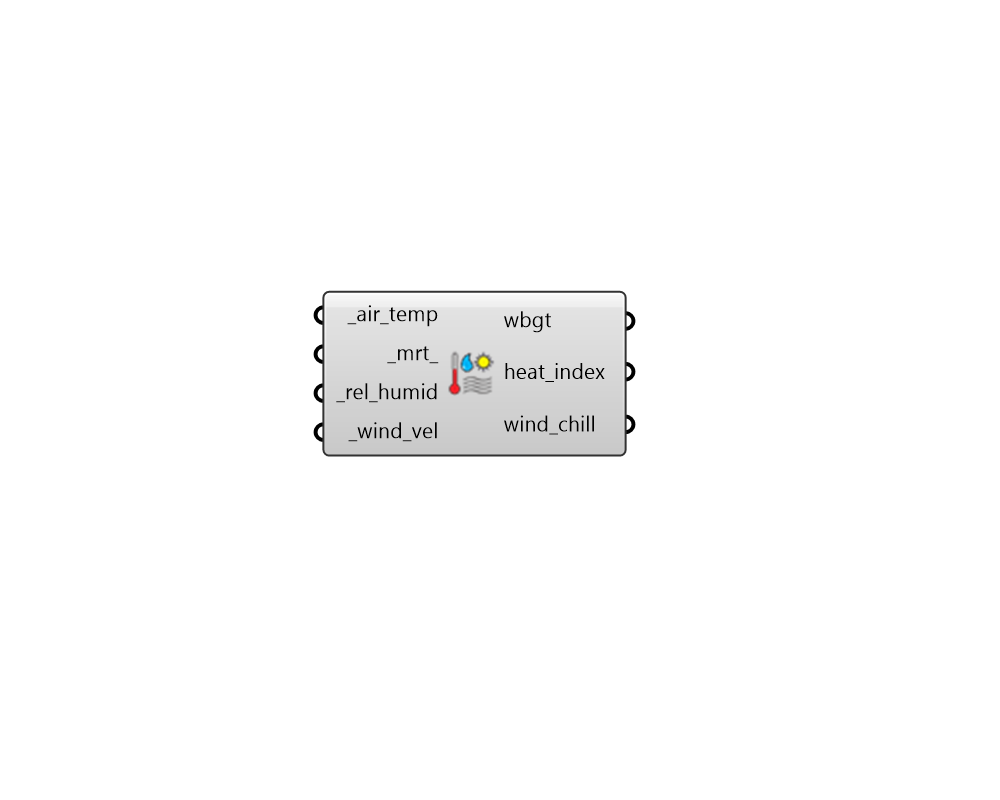

## Thermal Indices

 - [[source code]](https://github.com/ladybug-tools/ladybug-grasshopper/blob/master/ladybug_grasshopper/src//LB%20Thermal%20Indices.py)

Calculate thermal indices that have historically been used by meteorologists. All of them are "feels like" temperatures that attempt to account for factors beyond sir temperature. These include the following: 

* Wet Bulb Globe Temperature (WBGT) * Heat Index (HI) * Wind Chill Temperature (WCT) 

Most of these indices have fallen out of use in favor of Universal Thermal Climate Index (UTCI). However, they are still used in some regions and are a part of older codes and standards. 

#### Inputs
* ##### air_temp [Required]
Data Collection or individual value for air temperature in C. This input is used by all three metrics. 
* ##### mrt 
Data Collection or individual value for mean radiant temperature (MRT) in C. Default is the same as the air_temp. This input only affects the WBGT. 
* ##### rel_humid [Required]
Data Collection or individual value for relative humidity in %. Note that percent values are between 0 and 100. This input affects WBGT as well as HI. 
* ##### wind_vel [Required]
Data Collection or individual value for meteoroligical wind velocity at 10 m above ground level in m/s. This is used by both WBGT and WCT. 

#### Outputs
* ##### wbgt
A data collection or value for Wet Bulb Globe Temperature (WBGT) [C]. WBGT is a type of feels-like temperature that is widely used as a heat stress index (ISO 7243). It is incorporates the effect of temperature, humidity, wind speed, and mean radiant temperature (optionally including the effect of sun). 
* ##### heat_index
A data collection or value for Heat Index (HI) temperature [C]. Heat index is derived from original work carried out by Robert G. Steadman, which defined heat index through large tables of empirical data. The formula here approximates the heat index to within +/- 0.7C and is the result of a multivariate fit. Heat index was adopted by the US's National Weather Service (NWS) in 1979. 
* ##### wind_chill
A data collection or value for Wind Cill Temperature (WCT) [C]. Wind Chill Index is derived from original work carried out by Gregorczuk. It qualifies thermal sensations of a person in wintertime. It is especially useful at low and very low air temperature and at high wind speed. 