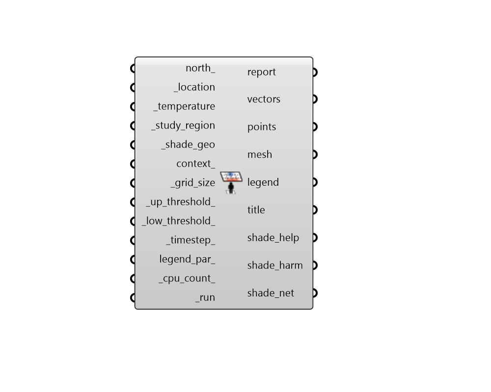

## Thermal Shade Benefit

 - [[source code]](https://github.com/ladybug-tools/ladybug-grasshopper/blob/master/ladybug_grasshopper/src//LB%20Thermal%20Shade%20Benefit.py)

Visualize the desirability of shade in terms of proximity of conditions to a favorable temerature range. 

The calculation runs by generating solar vectors for a data collection of input temperature values. Solar vectors for hours when the temperature is above the upper temperature threshold contribute positively to shade desirability (shade_help) while solar vectors for hours when the temperature is below the lower temperature threshold contribute negatively (shade_harm). 

The component outputs a colored mesh of the shade illustrating the net effect of shading each part of the _shade_geo. A higher saturation of blue indicates that shading the cell is desirable to avoid excessively hot temperatures. A higher saturation of red indicates that shading the cell is harmful, blocking helpful sun in cold conditions that could bring conditions closer to the desired temperature range. Desaturated cells indicate that shading the cell will have relatively little effect on keeping the _study_region in the desired thermal range. 

The units for shade desirability are degree-days per unit area of shade, which are essentially the amount of time in days that sun is blocked by a given cell multiplied by the degrees above (or below) the temperature thresholds during that time. So, if a given square meter of input _shade_geo has a shade desirability of 10 degree-days per square meter, this means that a shade in this location provides roughly 1 day of sun protection from conditions 10 degrees Celsius warmer than the _up_threshold_ to the _study_region. 

More information on the methods used by this component can be found in the following publication: Mackey, Christopher; Sadeghipour Roudsari, Mostapha; Samaras, Panagiotis. “ComfortCover: A Novel Method for the Design of Outdoor Shades.” In Proceedings of Symposium on Simulation for Architecture and Urban Design. Washington, DC, United States, Apr 12-15 2015. https://drive.google.com/file/d/0Bz2PwDvkjovJQVRTRHhMSXZWZjQ/view?usp=sharing 

#### Inputs
* ##### north 
A number between -360 and 360 for the counterclockwise difference between the North and the positive Y-axis in degrees. 90 is West and 270 is East. This can also be Vector for the direction to North. (Default: 0) 
* ##### location [Required]
A ladybug Location that has been output from the "LB Import EPW" component or the "LB Construct Location" component. 
* ##### temperature [Required]
An hourly data collection with the unshaded temperature experienced at the _study_region. This temperature will be used to evaluate shade benefit for this study region. This temperature data collection should typically be informed by an analysis with the "LB Outdoor Solar MRT" or the "LB Indoor Solar MRT" component, which will account for the increased temperature delta expereinced as a result of being in the sun. For evaluation of shade in terms of outdoor thermal comfort, the best practice is to use the Universal Thermal Climate Index (UTCI) temperature at the study region for this input. For evaluation of shade benefit in terms of indoor comfort,  the best practice is to use the Standard Effective Temperature (SET) derived from the "LB PMV Comfort" component for this input. In both cases, the MRT inputs to the thermal comfort models should use solar-adjusted MRT. 
* ##### study_region [Required]
Rhino Breps and/or Rhino Meshes representing an area for which shading desirability is being evaluated. This is often the region where a human subject will sit (eg. a bench) or it could be the window of a building where an occupant might be standing or sitting. 
* ##### shade_geo [Required]
Rhino Breps and/or Rhino Meshes representing shading to be evaluated in terms of its benefit. Note that, in the case that multiple shading geometries are connected, this component does not account for the interaction between the different shading surfaces and will just evaluate each part of the shade independently. 
* ##### context 
Rhino Breps and/or Rhino Meshes representing context geometry that can block sunlight to the _study_region, therefore discounting any benefit or harm that could come to the region. 
* ##### grid_size [Required]
A positive number in Rhino model units for the size of grid cells at which the input _shade_geo will be subdivided for shade benefit analysis. The smaller the grid size, the higher the resolution of the analysis and the longer the calculation will take.  So it is recommended that one start with a large value here and decrease the value as needed. However, the grid size should usually be smaller than the dimensions of the smallest piece of the _shade_geo and context_ in order to yield meaningful results. 
* ##### up_threshold 
A number representing the temperature in Celsius above which shade is considered desirable/helpful. The default is 26C, which corresponds to the upper limit of "No Thermal Stress" according to the UTCI thermal comfort model (above this, heat stress begins). A different value may be desirable for indoor thermal comfort studies. 
* ##### low_threshold 
A number representing the temperature in Celsius below which shade is considered harmful and access to the sun is preferable. The default is 9C, which corresponds to the lower limit of "No Thermal Stress" according to the UTCI thermal comfort model (below this, cold stress begins). A different value may be desirable for indoor thermal comfort studies. 
* ##### timestep 
An integer for the number of timesteps per hour at which sun vectors will be generated for the analysis. Higher values will result in the generation of more vectors, which will make the resulting shade mesh smoother and a better representation of shade benefit and harm. However, the calculation will take longer as there are more intersection operations to perform. The default is 1 timestep per hour, which is the coarsest resolution avalable and the fastest calculation. 
* ##### legend_par 
Optional legend parameters from the "LB Legend Parameters" that will be used to customize the display of the results. 
* ##### cpu_count 
An integer to set the number of CPUs used in the execution of the intersection calculation. If unspecified, it will automatically default to one less than the number of CPUs currently available on the machine or 1 if only one processor is available. 
* ##### run [Required]
Set to "True" to run the component and perform shade benefit analysis. 

#### Outputs
* ##### report
... 
* ##### vectors
The sun vectors that were used to evaluate the shade (note that these will increase as the _timestep_ increases). 
* ##### points
Points across the study_region from which sun vectors are projected. 
* ##### mesh
A colored mesh of the _shade_geo showing where shading is helpful (in blue), harmful (in red), or does not make much of a difference (white or desaturated colors). Note that the colors can change depending upon the input legend_par_. 
* ##### legend
Legend showing the numeric values of degree-days per unit are of shade that correspond to the colors in the shade mesh. 
* ##### title
A text object for the study title. 
* ##### shade_help
The cumulative degree-days per square area unit helped by shading each cell of the shade. If a given square meter of _shade_geo has a helpfulness of 10 degree-days/m2, this means that a shade in this location provides 1 day of sun protection from conditions 10 degrees warmer than the _up_threshold_ to the _study_region. 
* ##### shade_harm
The cumulative degree-days per square area unit harmed by shading each cell of the shade. If a given square meter of _shade_geo has a harmfulness of -10 degree-days, this means that a shade in this location blocks 1 day of sun duirng conditions that are 10 degrees Celsius colder than the _low_threshold_ to the _study_region. 
* ##### shade_net
The sum of the helpfulness and harmfulness for each cell. This will be negative if shading the cell has a net harmful effect and positive if the shade has a net helpful effect. 