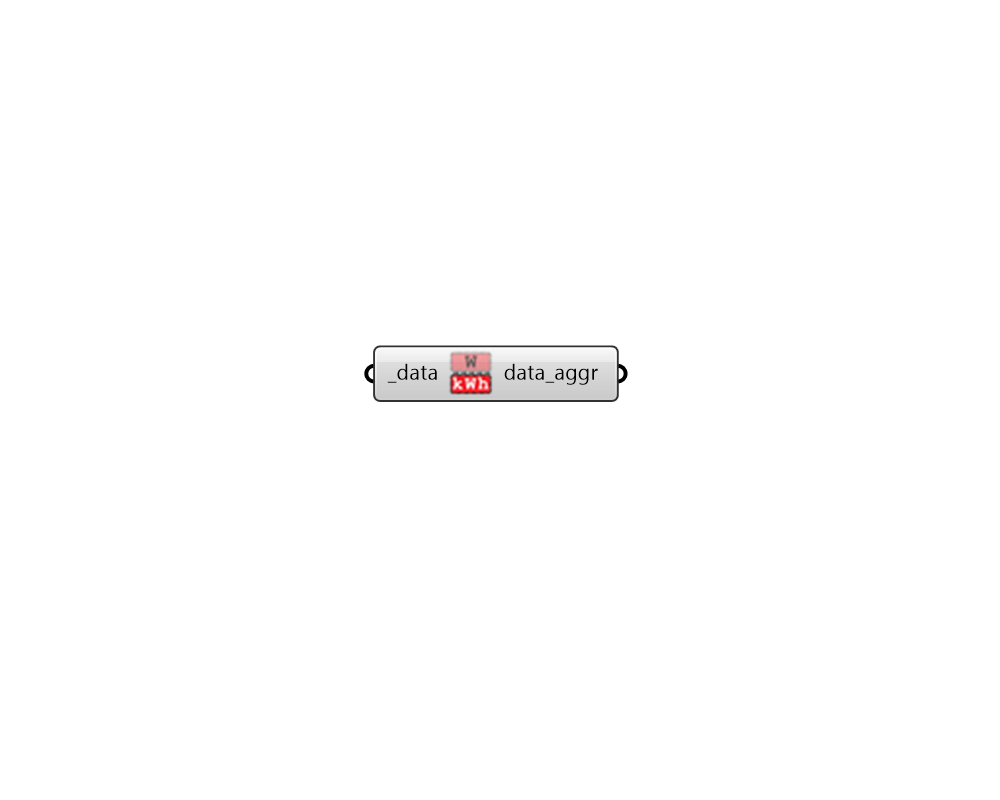

## Time Aggregate

 - [[source code]](https://github.com/ladybug-tools/ladybug-grasshopper/blob/master/ladybug_grasshopper/src//LB%20Time%20Aggregate.py)

Convert a DataCollection of point-in-time values to its time-aggregated equivalent. 

For example, if the collection has a Power data type in W, this method will return a collection with an Energy data type in kWh. 

#### Inputs
* ##### data [Required]
A houry, sub-hourly or daily data collection that can be aggregated over time to yield data of a different metric. (eg. a data collection of Power values in W). 

#### Outputs
* ##### data_aggr
The data collection aggregated over time. (eg. a data collection of Energy values in kWh). 